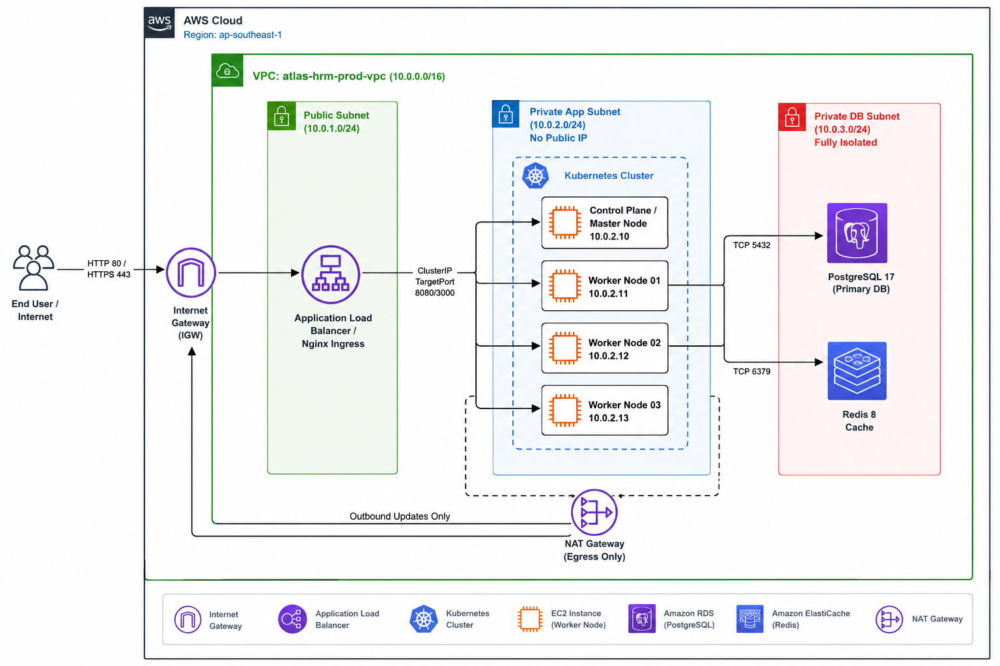

# 🚀 Atlas Enterprise Platform (HRM System)

> **Enterprise-Grade Multi-Tenant Human Resource Management System & Cloud-Native Infrastructure Architecture**



---

## 📋 MỤC LỤC

- [Tổng Quan Dự Án](#-tổng-quan-dự-án)
- [Kiến Trúc Hạ Tầng (Cloud-Native Architecture)](#-kiến-trúc-hạ-tầng-cloud-native-architecture)
- [Cấu Trúc Mã Nguồn (Repository Structure)](#-cấu-trúc-mã-nguồn-repository-structure)
- [Công Nghệ Sử Dụng (Tech Stack)](#-công-nghệ-sử-dụng-tech-stack)
- [Hướng Dẫn Chạy Môi Trường Local (Quick Start)](#-hướng-dẫn-chạy-môi-trường-local-quick-start)
- [Quy Trình Triển Khai Hạ Tầng DevOps (DevOps Runbook)](#-quy-trình-triển-khai-hạ-tầng-devops-devops-runbook)
- [Tài Liệu Hướng Dẫn Chuyên Sâu (Documentation)](#-tài-liệu-hướng-dẫn-chuyên-sâu-documentation)

---

## 🏢 TỔNG QUAN DỰ ÁN

**Atlas Enterprise Platform** là hệ thống Quản trị Nhân sự (HRM) chuẩn Enterprise, hỗ trợ mô hình kiến trúc **Multi-Tenant** linh hoạt, quản lý phân quyền IAM/RBAC chặt chẽ, quản lý chấm công, tổ chức, tài sản, tuyển dụng và tính lương tự động.

Hệ thống được thiết kế theo tiêu chuẩn **Cloud-Native**, tối ưu hóa tuyệt đối về bảo mật (Security Hardening), kích thước Container Image siêu nhẹ (Micro-images) và khả năng tự động mở rộng (Auto-scaling) trên Kubernetes.

---

## 🌐 KIẾN TRÚC HẠ TẦNG (CLOUD-NATIVE ARCHITECTURE)

Hạ tầng được thiết kế theo mô hình **AWS VPC 3-Tier Defense-in-Depth**:

1. **Public Subnet (`10.0.1.0/24`)**: Chứa Ingress Gateway / Load Balancer đón nhận Web Traffic.
2. **Private App Subnet (`10.0.2.0/24`)**: Chứa Kubernetes Cluster (Control Plane & Worker Nodes), hoàn toàn không có Public IP.
3. **Private DB Subnet (`10.0.3.0/24`)**: Chứa PostgreSQL 17 Primary Database & Redis 8 Cache (Cách ly tuyệt đối, chỉ cho phép truy cập từ Private App Subnet).

---

## 📂 CẤU TRÚC MÃ NGUỒN (REPOSITORY STRUCTURE)

```text
Atlas-Enterprise-Platform/
├── erp_platform_be/              # NestJS Backend Microservice
│   ├── src/                      # Mã nguồn ứng dụng NestJS (CQRS, Identity, HRM)
│   ├── prisma/                   # Schema Prisma & Database Migrations
│   └── Dockerfile                # Multi-stage Build tinh giản (~175MB)
│
├── erp_platform_fe/              # React Vite Frontend Application
│   ├── src/                      # UI Components (Ant Design, Tailwind, Zustand)
│   └── Dockerfile                # Nginx Unprivileged Non-Root Build (~25MB)
│
├── infrastructure/               # Infrastructure as Code (IaC)
│   ├── terraform/                # Modules Terraform (VPC, Security Groups, Compute)
│   └── ansible/                  # Roles Ansible CIS Hardening (SWAP, Sysctl, Containerd)
│
├── k8s/                          # Kubernetes Deployment Manifests
│   ├── 00-namespace.yaml         # Namespace cách ly hrm-system
│   ├── 01-configmap.yaml         # Biến môi trường hệ thống
│   └── 01-secret.yaml            # Mã hóa bí mật (Database, JWT)
│
└── docs/                         # Tài liệu Kiến trúc & DevOps Guides
    ├── AWS-HRM.png               # Sơ đồ hạ tầng AWS Blueprint
    └── stage-2-enterprise-iac-guide.md # Hướng dẫn chuyên sâu IaC Masterclass
```

---

## 🛠️ CÔNG NGHỆ SỬ DỤNG (TECH STACK)

### 🔹 Backend Ecosystem
* **Framework:** NestJS 11 (Node.js 22 LTS)
* **Database & ORM:** PostgreSQL 17 + Prisma ORM 7
* **Caching & Session:** Redis 8 (ioredis)
* **Security & Auth:** Passport JWT, Bcrypt, Helmet, OWASP Standards
* **Process Manager:** `tini` (PID 1 Init System)

### 🔹 Frontend Ecosystem
* **Core:** React 19 + Vite 8 + TypeScript
* **UI Components:** Ant Design 6 + TailwindCSS 3 + Lucide Icons
* **State & Data Fetching:** Zustand 5 + TanStack Query 5 (React Query)
* **Web Server:** Nginx 1.27 Unprivileged (Non-Root Port 8080)

### 🔹 DevOps & Cloud Infrastructure
* **Containerization:** Docker Multi-stage Builds (BuildKit Enabled)
* **IaC Provisioning:** Terraform (Modular Architecture)
* **Configuration Management:** Ansible Roles (CIS Benchmark Security)
* **Orchestration:** Kubernetes (K8s Deployments, StatefulSets, Ingress)

---

## 🚀 HƯỚNG DẪN CHẠY MÔI TRƯỜNG LOCAL (QUICK START)

### 1. Khởi động Backend (`erp_platform_be`)

```bash
cd erp_platform_be

# Cài đặt dependencies
npm install

# Tạo Prisma Client
npx prisma generate

# Khởi chạy môi trường Dev
npm run dev
```
Backend sẽ chạy tại endpoint: `http://localhost:3000`

### 2. Khởi động Frontend (`erp_platform_fe`)

```bash
cd erp_platform_fe

# Cài đặt dependencies
npm install

# Khởi chạy môi trường Dev
npm run dev
```
Frontend sẽ chạy tại endpoint: `http://localhost:5173`

---

## 🐳 QUY TRÌNH TRIỂN KHAI HẠ TẦNG DEVOPS (DEVOPS RUNBOOK)

### Bước 1: Build Docker Images Chuẩn Production

```bash
# 1. Build Backend Image (~175MB)
cd erp_platform_be
docker build -t erp-backend:latest .

# 2. Build Frontend Image (~25MB)
cd ../erp_platform_fe
docker build -t erp-frontend:latest .
```

### Bước 2: Provisioning Hạ Tầng Mạng & Nodes bằng Terraform

```bash
cd infrastructure/terraform

# Khởi tạo & áp dụng mã nguồn IaC
terraform init
terraform apply -auto-approve
```

### Bước 3: Hardening Security Nodes bằng Ansible

```bash
cd ../ansible

# Thực thi Master Playbook cấu hình Server Nodes
ansible-playbook -i inventory/hosts.ini playbooks/site.yml
```

---

## 📚 TÀI LIỆU HƯỚNG DẪN CHUYÊN SÂU (DOCUMENTATION)

* 📄 [Tài Liệu Chi Tiết Stage 2: Enterprise IaC Masterclass Guide](docs/stage-2-enterprise-iac-guide.md)
* 📄 [Tài Liệu Tối Ưu Hóa Docker Images (Giảm 78% Dung Lượng)](docs/stage-2-enterprise-iac-guide.md#3-phân-tích-chi-tiết-kỹ-thuật-giảm-78-dung-lượng-800mb--175mb)

---

### 📝 License & Maintainer
* **Maintainer:** Senior Software Engineer & DevOps Architect
* **Project Status:** Production-Ready Architecture (70%+ Completed)
