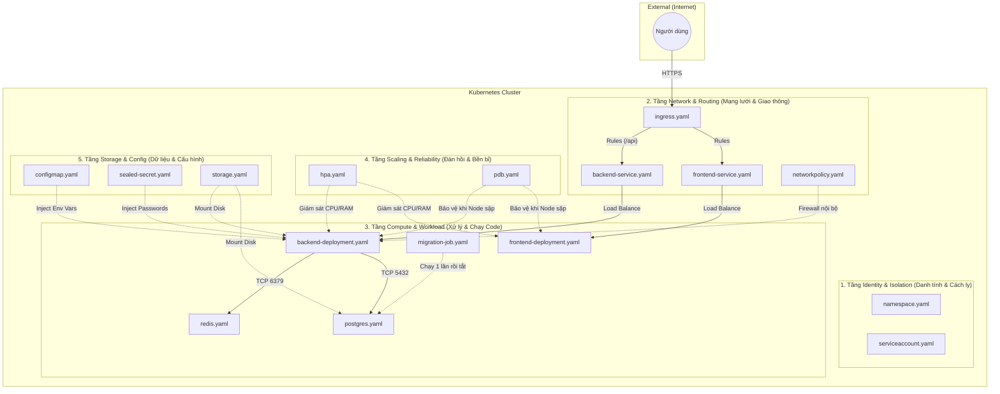

# 🗺️ Helm to Kubernetes Architecture Map

> Tài liệu này ánh xạ 18 file YAML trong thư mục `charts/atlas-hrm/templates/` vào đúng vị trí và vai trò của nó bên trong một cụm Kubernetes thực tế.

---

## 1. SƠ ĐỒ TỔNG THỂ (THE BIG PICTURE)

Hãy tưởng tượng Cụm K8s là một Tòa nhà Văn phòng. Các file YAML của chúng ta đóng vai trò xây dựng nên các phòng ban, hệ thống điện nước, và bảo vệ cho tòa nhà đó.

---

## 2. GIẢI PHẪU CHI TIẾT TỪNG TẦNG (LAYERS)

### 🛡️ Tầng 1: Identity & Isolation (Danh tính & Cách ly)
> **Vai trò:** Tạo ranh giới vật lý ảo và thẻ căn cước cho ứng dụng.

*   `namespace.yaml`: Đóng vai trò là **"Mảnh đất ảo"**. Tất cả tài nguyên của Atlas HRM sẽ nằm gọn trong đây (vd: `hrm-system`). Xóa Namespace là xóa sạch mọi thứ bên trong. Không để lẫn lộn với các app khác.
*   `serviceaccount.yaml`: Đóng vai trò là **"Thẻ nhân viên"** cho các Pod. Khi Pod (Backend) muốn gọi lên K8s API (hoặc gọi ra AWS S3 qua IRSA), nó phải trình thẻ này ra để K8s kiểm tra quyền hạn (RBAC).

---

### 🌐 Tầng 2: Network & Routing (Mạng lưới & Giao thông)
> **Vai trò:** Điều phối dòng chảy traffic từ ngoài Internet vào tận giường của ứng dụng.

*   `ingress.yaml`: Đóng vai trò là **"Lễ tân tòa nhà"**. Nó đứng ở rìa cụm (Edge), cầm chứng chỉ bảo mật (SSL/TLS), kiểm tra thẻ domain (`hrm.local`). Nếu user xin vào cổng `/api`, Lễ tân chỉ đường sang phòng Backend. Nếu xin vào `/`, Lễ tân chỉ sang phòng Frontend.
*   `frontend-service.yaml` & `backend-service.yaml`: Đóng vai trò là **"Tổng đài viên nội bộ"**. IP của Pod thay đổi liên tục (vì bị xóa/tạo mới), Service cung cấp một cái tên cố định (DNS nội bộ, vd: `atlas-hrm-backend`). Bất cứ ai gọi tên này, Service sẽ tự động chia đều tải (Load Balancing) xuống các Pod đang sống.
*   `networkpolicy.yaml`: Đóng vai trò là **"Bảo vệ hành lang"** (Internal Firewall). Chặn không cho nhân viên phòng này tự tiện lẻn sang phòng khác (VD: Chặn Frontend chọc thẳng vào Database).

---

### ⚙️ Tầng 3: Compute & Workload (Xử lý & Chạy Code)
> **Vai trò:** Nơi thực sự chứa các Docker Container đang chạy code. (Đây là công nhân làm việc).

*   `backend-deployment.yaml` & `frontend-deployment.yaml`: Đóng vai trò là **"Bản thiết kế & Quản đốc"**. Khai báo rằng "Tôi muốn 3 anh công nhân (Pod) chạy image NestJS, mặc áo lưới bảo hộ (SecurityContext), và phải khám sức khỏe liên tục (Probes)". K8s sẽ luôn đảm bảo có đúng 3 anh đang làm việc.
*   `postgres.yaml` & `redis.yaml`: Các Stateful workload (chạy Database).
*   `migration-job.yaml`: Khác với Deployment (chạy mãi mãi), Job là **"Lính đánh thuê"**. Nó được gọi ra (khi cài Helm chart), chạy đúng 1 lệnh `npx prisma migrate`, xong việc là tự kết liễu và tắt máy, giải phóng tài nguyên.

---

### 💾 Tầng 4: Storage & Config (Dữ liệu & Cấu hình)
> **Vai trò:** Cung cấp "Não bộ" (cấu hình) và "Dạ dày" (ổ cứng) cho công nhân (Pod).

*   `configmap.yaml`: Đóng vai trò là **"Sổ tay hướng dẫn"** (chứa PORT, HOST, NODE_ENV...). Pod khi bật lên sẽ lấy sổ tay này ra đọc để biết phải chạy ở cổng nào. Không bao giờ chứa mật khẩu.
*   `sealed-secret.yaml`: Đóng vai trò là **"Két sắt"** (chứa Password, JWT Token). Nó được mã hóa an toàn ở dạng SealedSecret để lỡ mã nguồn bị lộ trên GitHub, hacker cũng không đọc được. K8s sẽ tự mở két (decrypt) lúc nhét vào Pod.
*   `storage.yaml`: Chứa các định nghĩa PVC (Persistent Volume Claim). Đóng vai trò là **"Ổ cứng cắm ngoài (USB)"**. K8s mặc định là Stateless (Pod sập là mất hết dữ liệu). Phải có PVC gắn vào DB để khi Pod DB chết, Pod mới mọc lên cắm lại cái USB đó vào, dữ liệu nguyên vẹn.

---

### 🚀 Tầng 5: Scaling & Reliability (Đàn hồi & Bền bỉ)
> **Vai trò:** Can thiệp vào vòng đời (Lifecycle) của Pod để bảo vệ hệ thống khỏi các thảm họa (Traffic tăng đột biến, Node bị sập).

*   `hpa.yaml` (Horizontal Pod Autoscaler): Đóng vai trò là **"Giám đốc nhân sự"**. Đứng nhìn CPU của các Pod. Nếu thấy CPU > 70%, lập tức hô hào đẻ thêm Pod mới. Nếu thấy rảnh rỗi, từ từ cho Pod nghỉ bớt để tiết kiệm tiền AWS.
*   `pdb.yaml` (Pod Disruption Budget): Đóng vai trò là **"Công đoàn bảo vệ người lao động"**. Khi ông sếp (Ops Engineer) muốn đập bỏ tòa nhà (Drain Node) để sửa chữa, Công đoàn (PDB) sẽ giơ biển báo cấm: "Anh không được đuổi hết công nhân! Phải luôn chừa lại ít nhất 1 người (minAvailable: 1) để tiếp khách". Nhờ vậy, hệ thống không bao giờ bị Zero-Downtime do lỗi bảo trì.

---

### 🛠️ Các File Phụ Trợ của Helm

*   `_helpers.tpl`: Không sinh ra tài nguyên K8s nào cả. Nó là bộ thư viện (Library) để các file YAML khác dùng chung (để tự động sinh tên chuẩn `atlas-hrm-backend`, dán nhãn label chuẩn...).
*   `NOTES.txt`: Lời chào mừng. Khi anh gõ `helm install`, K8s sẽ in nội dung file này ra màn hình đen của Terminal (chứa link URL, cách check log).
