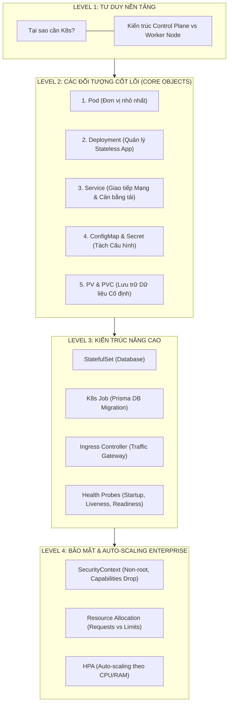

# ☸️ MASTERCLASS LÝ THUYẾT KUBERNETES: TỪ CĂN BẢN ĐẾN ENTERPRISE NÂNG CAO
### *Dự Án: Atlas Enterprise Platform (HRM System)*

Tài liệu hướng dẫn lý thuyết chuyên sâu về Kiến trúc Kubernetes (K8s), đi từ tư duy hình dung cơ bản ➔ các đối tượng cốt lõi ➔ cơ chế vận hành nâng cao ➔ bảo mật & auto-scaling chuẩn Enterprise.

---

## 📋 MỤC LỤC

1. [Cấp Độ 1: Tư Duy Nền Tảng (Basic Mental Model)](#-cấp-độ-1-tư-duy-nền-tảng-level-1---basic-mental-model)
2. [Cấp Độ 2: Các Đối Tượng Cốt Lõi Trong K8s (Core Objects)](#-cấp-độ-2-các-đối-tượng-cốt-lõi-trong-k8s-level-2---core-objects)
3. [Cấp Độ 3: Kiến Trúc Nâng Cao (Advanced Architecture)](#-cấp-độ-3-kiến-trúc-nâng-cao-level-3---advanced-architecture)
4. [Cấp Độ 4: Bảo Mật & Auto-Scaling Enterprise](#-cấp-độ-4-bảo-mật--auto-scaling-enterprise-level-4)
5. [Bảng Tóm Tắt Mapping Với Dự Án Atlas HRM](#-bảng-tóm-tắt-mapping-với-dự-án-atlas-hrm)

---



---

# 🟢 CẤP ĐỘ 1: TƯ DUY NỀN TẢNG (LEVEL 1 - BASIC MENTAL MODEL)

### 1.1. Tại Sao Cần Kubernetes? (Bài toán Quản trị Tập trung)
Nếu bạn chỉ chạy 1 server với 2 container (Frontend + Backend), **Docker Compose** là đủ.  
Nhưng khi hệ thống của bạn phát triển lên mô hình Enterprise với **hàng chục Server Nodes và hàng trăm Containers**:

* **Vấn đề 1 (Sự cố Crash):** Nếu Server số 3 bị sập nguồn lúc 2 giờ sáng, ai sẽ là người vào bật lại các container trên server khác?
* **Vấn đề 2 (Quá tải Traffic):** Khi có đợt truy cập tăng đột biến, ai sẽ nhanh chóng nhân bản Backend từ 2 container lên 20 container và tự phân phối lượng truy cập?
* **Vấn đề 3 (Nâng cấp không gián đoạn):** Làm sao để Deploy bản Code mới mà người dùng đang sử dụng **không bị gián đoạn dù chỉ 1 giây** (Zero-downtime Rolling Update)?

👉 **Kubernetes (K8s)** ra đời để làm đúng nhiệm vụ đó: Nó đóng vai trò là một **Hệ Thống Tự Động Hóa Quản Lý Cả Đội Container (Container Orchestrator)**.

---

### 1.2. Kiến Trúc Bộ Não Master (Control Plane) & Đội Công Nhân (Worker Nodes)

Một Cluster Kubernetes luôn bao gồm 2 nhóm thành phần chính:

```text
 ┌────────────────────────────────────────────────────────────────────────┐
 │                    CONTROL PLANE (MASTER NODE) - BỘ NÃO                │
 │                                                                        │
 │  ┌─────────────────┐   ┌───────────────────┐   ┌────────────────────┐  │
 │  │ kube-apiserver  │   │       etcd        │   │   kube-scheduler   │  │
 │  │ (Cổng tiếp nhận)│   │ (Sổ nhật ký dữ liệu)│   │ (Người phân việc)  │  │
 │  └────────┬────────┘   └───────────────────┘   └────────────────────┘  │
 │           │                                                            │
 └───────────┼────────────────────────────────────────────────────────────┘
             │ Ra lệnh qua mạng nội bộ
 ┌───────────┴────────────────────────────────────────────────────────────┐
 │                    WORKER NODES - ĐỘI CÔNG NHÂN THỰC THI              │
 │                                                                        │
 │  ┌──────────────────────────────────┐  ┌────────────────────────────┐  │
 │  │            kubelet               │  │         kube-proxy         │  │
 │  │  (Đội trưởng cai quản Node)      │  │ (Cảnh sát điều hướng mạng) │  │
 │  └──────────────────┬───────────────┘  └────────────────────────────┘  │
 │                     │                                                  │
 │                     ▼                                                  │
 │         [ Pod NestJS ]  [ Pod React ]  [ Pod Postgres ]                │
 └────────────────────────────────────────────────────────────────────────┘
```

#### A. Control Plane (Master Node - Bộ Não Điều Hành)
1. **`kube-apiserver`**: Cổng giao tiếp duy nhất của K8s. Mọi lệnh bạn gõ (`kubectl apply`), hoặc CI/CD pipeline gửi tới, đều đi qua API Server để kiểm tra quyền hạn.
2. **`etcd`**: Cơ sở dữ liệu Key-Value cực kỳ an toàn. Nơi K8s lưu trữ **toàn bộ trạng thái thực tế của Cluster** (Ai đang sống, Pod nào đang chạy ở đâu).
3. **`kube-scheduler`**: Người phân công công việc. Khi bạn muốn tạo Pod mới, Scheduler sẽ tính toán xem Worker Node nào đang rảnh RAM/CPU nhất để xếp Pod vào đó.
4. **`kube-controller-manager`**: Người giám sát thực thi liên tục. Nếu phát hiện 1 Pod bị chết, nó sẽ ra lệnh cho Scheduler tạo Pod mới thay thế (**Self-healing**).

#### B. Worker Node (Máy Chủ Thực Thi Ứng Dụng)
1. **`kubelet`**: Đội trưởng cai quản trên từng Worker Node. Kubelet nhận lệnh từ `kube-apiserver` và điều khiển Container Runtime (`containerd`) để bật/tắt các Pod.
2. **`kube-proxy`**: Cảnh sát giao thông mạng. Chịu trách nhiệm tạo đường truyền IP và phân phối Traffic giữa các Pod trên các máy chủ khác nhau.

---

# 🟡 CẤP ĐỘ 2: CÁC ĐỐI TƯỢNG CỐT LÕI TRONG K8S (LEVEL 2 - CORE OBJECTS)

Để ứng dụng NestJS + React + PostgreSQL + Redis của bạn chạy được trên K8s, chúng ta làm việc với 5 đối tượng cốt lõi:

### 2.1. Pod (Đơn Vị Nhỏ Nhất Trong K8s)
* **Pod là gì?** Pod là một "vỏ bọc" chứa một hoặc một vài Container chung dải mạng IP và chung ổ đĩa.
* **Quy tắc vàng:** 99% trường hợp, **1 Pod = 1 Container** (Ví dụ: 1 Pod chạy NestJS Backend). Bạn không thao tác trực tiếp với Container mà luôn thao tác với Pod.

### 2.2. Deployment (Quản Lý Ứng Dụng Không Trạng Thái - Stateless)
* Pod có tính chất **tạm thời (Ephemeral)**: Khi bị chết, K8s tạo Pod mới sẽ có địa chỉ IP mới.
* **Deployment** là đối tượng đứng ra quản lý tập hợp các Pods. Bạn khai báo trong Deployment: *"Tôi muốn luôn luôn duy trì 3 bản sao (replicas: 3) của NestJS Backend"*. Deployment sẽ tự động giám sát và duy trì đủ 3 Pods đó.

### 2.3. Service (Tên Miền & Cân Bằng Tải Cố Định)
Vì Pod có thể bị diệt và tạo lại liên tục khiến IP thay đổi, **Service** ra đời làm địa chỉ IP / Tên miền cố định đứng phía trước để đại diện cho tập hợp các Pod.

K8s có 3 loại Service chính:
1. **`ClusterIP` (Mặc định)**: Chỉ tạo IP nội bộ bên trong Cluster. Dùng cho Backend, Postgres, Redis để các service trong K8s gọi nhau an toàn.
2. **`NodePort`**: Mở cổng trực tiếp ra địa chỉ IP của máy chủ vật lý (Range port `30000-32767`).
3. **`LoadBalancer`**: Tự động gọi API lên Cloud (AWS/GCP) để thuê một con Load Balancer thật từ Cloud Provider.

### 2.4. ConfigMap & Secret (Tách Biệt Cấu Hình & Code - 12-Factor App)
* **`ConfigMap`**: Lưu trữ các biến môi trường không nhạy cảm (như `PORT=3000`, `NODE_ENV=production`, `LOG_LEVEL=info`).
* **`Secret`**: Lưu trữ các dữ liệu mã hóa nhạy cảm (như `DATABASE_URL`, `JWT_SECRET`, `AWS_ACCESS_KEY`).

### 2.5. PersistentVolume (PV) & PersistentVolumeClaim (PVC)
Mặc định khi một Pod bị xóa, mọi dữ liệu lưu bên trong nó sẽ bị mất sạch.
* **`PV` (PersistentVolume)**: Ổ đĩa lưu trữ thực tế trên hạ tầng (Cloud Elastic Block Store hoặc Ổ cứng máy chủ).
* **`PVC` (PersistentVolumeClaim)**: "Tờ phiếu yêu cầu thuê ổ đĩa" của Pod. Pod khai báo *"Tôi muốn thuê 10GB đĩa cứng để chứa dữ liệu PostgreSQL"*, K8s sẽ tự động nối (Mount) PVC đó vào Pod.

---

# 🟠 CẤP ĐỘ 3: KIẾN TRÚC NÂNG CAO (LEVEL 3 - ADVANCED ARCHITECTURE)

### 3.1. StatefulSet (Dành Cho Cơ Sở Dữ Liệu - Stateful Apps)
* **Deployment** thích hợp cho Stateless App (NestJS/React) vì Pod nào cũng giống hệt nhau, chết con này thay con khác vô tư.
* **StatefulSet** dành riêng cho Database (PostgreSQL/Redis/MongoDB):
  * Mỗi Pod sinh ra có định danh tên duy nhất và cố định (`postgres-0`, `postgres-1`).
  * Mỗi Pod được gắn với 1 ổ đĩa PVC độc lập không bị xáo trộn khi restart.

### 3.2. K8s Job & CronJob (Tự Động Hóa Nhiệm Vụ 1 Lần)
* **Job**: Chạy một công việc xong rồi **tự động ngắt** (Ví dụ: Chạy lệnh `npx prisma migrate deploy` để cập nhật bảng DB trước khi App mới khởi chạy).
* **CronJob**: Chạy định kỳ theo lịch cron (Ví dụ: Chạy script backup database lúc 2h sáng mỗi ngày).

### 3.3. Ingress & Ingress Controller (Cổng Gateway Tập Trung)
Nếu bạn có 10 Microservices, bạn không thể tạo 10 con Load Balancer Cloud (rất đắt tiền).
* **Ingress** đóng vai trò là con **Reverse Proxy (Gateway Duy Nhất)** đứng ngoài cùng.
* Nó nhận toàn bộ Web Traffic (Port 80/443) từ Internet và thực hiện routing theo URL Path:
  * Truy cập `hrm.com/` ➔ Chuyển traffic vào **Frontend Service**
  * Truy cập `hrm.com/api/v1` ➔ Chuyển traffic vào **Backend Service**

```text
 User Traffic ➔ Ingress Controller (Nginx) ┬─► /       ➔ Frontend Service ➔ Frontend Pods
                                           └─► /api/v1 ➔ Backend Service  ➔ Backend Pods
```

### 3.4. Tam Giác Health Checks (Probes)
K8s kiểm tra "sức khỏe" của Pod thông qua 3 Probes:

1. **`startupProbe` (Kiểm tra Khởi động):**
   * Hỏi: *"Ứng dụng đã load xong dữ liệu ban đầu chưa?"*
   * Tác dụng: Dành cho các App nặng mất 30-60s để start. Trong lúc probe này đang kiểm tra, K8s tạm thời ngưng các check khác để tránh diệt nhầm App.
2. **`livenessProbe` (Kiểm tra Sự sống):**
   * Hỏi: *"Ứng dụng có bị treo (Deadlock/Frozen) không?"*
   * Tác dụng: Nếu endpoint `/health` trả về lỗi 500 hoặc timeout ➔ K8s sẽ **tự động kill Pod và khởi động lại Pod mới** (Self-healing).
3. **`readinessProbe` (Kiểm tra Sẵn sàng):**
   * Hỏi: *"Ứng dụng đã sẵn sàng nhận Request từ User chưa (Ví dụ đã connect DB xong chưa)?"*
   * Tác dụng: Nếu chưa ready ➔ K8s tạm thời rút Pod ra khỏi Load Balancer để không gửi request của User vào đó (tránh lỗi 502/503 cho User).

---

# 🔴 CẤP ĐỘ 4: BẢO MẬT & AUTO-SCALING ENTERPRISE (LEVEL 4)

### 4.1. Pod SecurityContext (Siết Chặt Bảo Mật Container)
Theo tiêu chuẩn bảo mật khắt khe nhất của Kubernetes (**Pod Security Standards - Restricted Profile**):

```yaml
securityContext:
  runAsNonRoot: true         # Cấm tuyệt đối chạy bằng user Root
  runAsUser: 1001            # Ép chạy dưới UID 1001 (nestjs user)
  readOnlyRootFilesystem: true # Khóa toàn bộ đĩa Container thành Read-Only chống Hacker sửa code
  capabilities:
    drop:
      - ALL                  # Tước bỏ 100% quyền Linux Kernel Capabilities thừa
```

### 4.2. Resource Allocation (Requests vs. Limits)
Khi khai báo tài nguyên cho Pod, bạn bắt buộc phải định nghĩa 2 thông số:

* **`requests` (Tài nguyên cam kết tối thiểu):** K8s dựa vào con số này để Scheduler tìm Node có đủ RAM/CPU đưa Pod vào.
  * *Ví dụ:* `memory: 256Mi`, `cpu: 250m` (0.25 CPU Core).
* **`limits` (Giới hạn tài nguyên tối đa):** Mức trần Pod được phép dùng.
  * Nếu Pod vượt quá **CPU Limit** ➔ K8s sẽ bóp tiến trình lại (CPU Throttling).
  * Nếu Pod vượt quá **RAM Limit** ➔ K8s sẽ ra lệnh diệt Pod lập tức (**OOMKilled - Out Of Memory**).

### 4.3. Horizontal Pod Autoscaler (HPA - Tự Động Nhân Bản Pods)
HPA tự động giám sát lượng CPU / RAM thực tế của ứng dụng thông qua `metrics-server`:

* **Cấu hình HPA:** Ngưỡng CPU trung bình = 70%, Min Replicas = 2, Max Replicas = 10.
* **Kịch bản thực tế:** Khi có đợt Sale lớn, CPU của Backend vọt lên 85% ➔ HPA tự động nhân bản Pod từ **2 Pods ➔ 5 Pods ➔ 8 Pods** để gánh tải. Khi hết đợt truy cập, CPU hạ xuống < 30% ➔ HPA tự động thu nhỏ số Pods về lại 2 để tiết kiệm chi phí!

---

## 📊 BẢNG TÓM TẮT MAPPING VỚI DỰ ÁN ATLAS HRM

| Thành phần Dự án | Đối tượng K8s tương ứng | Mục đích kỹ thuật |
| :--- | :--- | :--- |
| **Dải phân vùng dự án** | `Namespace: hrm-system` | Cách ly hoàn toàn với các app khác trên Cluster |
| **Cấu hình DB & JWT** | `ConfigMap` & `Secret` | Tách rời biến môi trường khỏi mã nguồn |
| **PostgreSQL 17 & Redis 8** | `Deployment` + `PVC` (10GB/2GB) | Lưu dữ liệu lâu dài không bị mất khi restart |
| **Prisma Migration** | `K8s Job` | Chạy lệnh `prisma migrate deploy` 1 lần trước khi BE bật |
| **NestJS Backend (BE)** | `Deployment` (replicas: 2) + `ClusterIP` | Chạy 2 bản sao BE, có Probes & SecurityContext |
| **React Vite Frontend (FE)** | `Deployment` (replicas: 2) + `ClusterIP` | Chạy 2 bản sao FE Nginx Non-root Port 8080 |
| **Gateway Routing** | `Nginx Ingress Controller` | Điều hướng `hrm.local/` ➔ FE, `hrm.local/api` ➔ BE |
