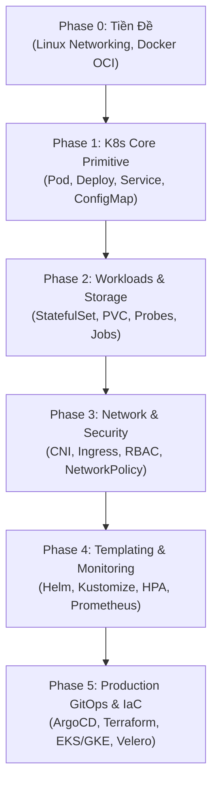

# ☸️ LỘ TRÌNH HỌC KUBERNETES BÀI BẢN TỪ ZERO ĐẾN ENTERPRISE PRODUCTION ENGINEER

> **Tài liệu Lộ Trình Học Tập Kubernetes Chuyên Sâu (Production Roadmap)**  
> *Dành cho DevOps Engineer, Backend Engineer, và System Administrator muốn làm chủ Kubernetes chuẩn thực tế doanh nghiệp.*

---

## 📌 MỤC LỤC

1. [Tổng Quan Định Hướng Học K8s](#-tổng-quan-định-hướng-học-k8s)
2. [Phase 0: Tiền Đề Bắt Buộc (Prerequisites)](#-phase-0-tiền-đề-bắt-buộc-prerequisites)
3. [Phase 1: K8s Core Mental Model & Basics (Trình Độ CKAD Part 1)](#-phase-1-k8s-core-mental-model--basics-trình-độ-ckad-part-1)
4. [Phase 2: Lưu Trữ, Lifecycle & Workloads Nâng Cao (Trình Độ CKAD Part 2)](#-phase-2-lưu-trữ-lifecycle--workloads-nâng-cao-trình-độ-ckad-part-2)
5. [Phase 3: Networking, Security & Isolation (Trình Độ CKA / CKS)](#-phase-3-networking-security--isolation-trình-độ-cka--cks)
6. [Phase 4: Templating, Auto-scaling & Observability (Enterprise Operator)](#-phase-4-templating-auto-scaling--observability-enterprise-operator)
7. [Phase 5: GitOps, Infrastructure as Code & Production Operations](#-phase-5-gitops-infrastructure-as-code--production-operations)
8. [🛠️ Bộ Toolstack Chuẩn Enterprise Bắt Buộc Làm Chủ](#️-bộ-toolstack-chuẩn-enterprise-bắt-buộc-làm-chủ)
9. [🎓 Lộ Trình Chứng Chỉ Quốc Tế (CNCF Certifications)](#-lộ-trình-chứng-chỉ-quốc-tế-cncf-certifications)

---

## 🎯 TỔNG QUAN ĐỊNH HƯỚNG HỌC K8S

Hầu hết mọi người học K8s gãy/nản vì **"nhảy xô vào gõ lệnh `kubectl apply` mà không hiểu bản chất bên dưới"** hoặc **"chỉ dừng lại ở mức deploy 1 file YAML phẳng đơn giản"**.

Một lộ trình học chuẩn bài bản phải đi qua **6 Giai Đoạn (Phases)**:

---

## 🟢 PHASE 0: TIỀN ĐỀ BẮT BUỘC (PREREQUISITES)
*Thời lượng khuyến nghị: 1 - 2 tuần*

Trước khi đụng vào Kubernetes, bạn bắt buộc phải có nền tảng vững chắc về **Linux** và **Containerization**. Nếu thiếu phần này, khi gặp lỗi mạng/permission trên K8s bạn sẽ hoàn toàn "mù tịt".

### 1. Kiến thức Linux & Networking nền tảng:
- **Process & User Management**: Process IDs, Signals (`SIGTERM`, `SIGKILL`), Non-root execution (`UID/GID`).
- **Linux Kernel Namespaces & cgroups**: Hiểu cách Linux cô lập tiến trình (PID, NET, MNT namespaces) và giới hạn tài nguyên (CPU/RAM cgroups).
- **Networking cơ bản**: IP CIDR, Subnetting, Port forwarding, DNS resolution, IPtables/Nftables basics, HTTP/HTTPS & SSL/TLS Certificates.

### 2. Containerization Mastery (Docker / Containerd):
- Viết `Dockerfile` chuẩn Production: Multi-stage builds, Alpine/Distroless base image, OCI Image spec.
- Giảm dung lượng image (từ 1GB xuống < 100MB).
- Docker Networking: Bridge, Host, Overlay network.
- Docker Volumes & Persistence.

---

## 🟡 PHASE 1: K8S CORE MENTAL MODEL & BASICS (CKAD PART 1)
*Thời lượng khuyến nghị: 2 tuần*

Mục tiêu: Hiểu kiến trúc bộ não K8s và làm chủ các đối tượng cốt lõi.

### 1. K8s Internal Architecture (Hiểu rõ cơ chế bên dưới):
- **Control Plane (Master Node)**:
  - `kube-apiserver`: Cổng REST API duy nhất.
  - `etcd`: Key-value store lưu trạng thái Cluster.
  - `kube-scheduler`: Phân bổ Pod vào Node.
  - `kube-controller-manager`: Giám sát và tự chữa lỗi (Self-healing).
- **Worker Node**:
  - `kubelet`: Agent điều khiển Container Runtime (`containerd`).
  - `kube-proxy`: Cấu hình IPtables/IPVS để routing mạng.

### 2. Thao tác với các Resource Primitives:
- **`Namespace`**: Phân vùng ảo cách ly tài nguyên.
- **`Pod`**: Đơn vị tính toán nhỏ nhất (Pod lifecycle, Pending, Running, CrashLoopBackOff).
- **`Deployment` & `ReplicaSet`**: Quản lý Stateless Apps, Rolling Update, Rollback.
- **`Service`**: Cân bằng tải nội bộ (`ClusterIP`, `NodePort`, `LoadBalancer`).
- **`ConfigMap` & `Secret`**: Tách biến môi trường và dữ liệu mã hóa khỏi code.

### 🧪 Bài Tập Lab Thực Hành Phase 1:
- Dùng `Kind` hoặc `Minikube` dựng cluster 3-nodes trên máy local.
- Viết file YAML deploy ứng dụng Node.js/Python 2-tier (App + Redis) kết nối qua `ClusterIP` Service.
- Thực hành thao tác lệnh CLI `kubectl` mà không cần xem tài liệu (Imperative commands vs Declarative YAML).

---

## 🟠 PHASE 2: LƯU TRỮ, LIFECYCLE & WORKLOADS NÂNG CAO (CKAD PART 2)
*Thời lượng khuyến nghị: 2 - 3 tuần*

Mục tiêu: Đưa các ứng dụng phức tạp có trạng thái (Stateful Apps) và các công việc định kỳ lên Cluster.

### 1. Storage & Persistence:
- **PersistentVolume (PV)** & **PersistentVolumeClaim (PVC)**: Khác biệt giữa tĩnh (Static) và động (Dynamic Provisioning).
- **StorageClass**: Khai báo loại đĩa (gp3, io2 trên AWS, SSD trên GCP).
- **Volume Mounts**: Đưa đĩa vào đúng đường dẫn container.

### 2. Workload Controllers Nâng Cao:
- **`StatefulSet`**: Dành cho Database (Postgres, Redis, MongoDB). Hiểu thứ tự khởi tạo pod (`postgres-0`, `postgres-1`) và gắn PVC cố định.
- **`DaemonSet`**: Chạy 1 Pod duy nhất trên mỗi Node (Dùng cho Log Collector như Fluentbit, Monitoring NodeExporter).
- **`Job` & `CronJob`**: Chạy task 1 lần (DB Migration) hoặc định kỳ (Backup DB).

### 3. Application Lifecycle Management:
- **Tam giác Health Checks**: `startupProbe`, `readinessProbe`, `livenessProbe`.
- **Graceful Shutdown**: Cấu hình `preStop` hook và `terminationGracePeriodSeconds` để Pod đóng kết nối an toàn trước khi bị diệt.

### 🧪 Bài Tập Lab Thực Hành Phase 2:
- Triển khai PostgreSQL 17 đơn lẻ có PVC 10GB lưu trữ dữ liệu bền vững.
- Tạo một K8s `Job` chạy lệnh `prisma migrate` / `flyway` tự động tạo schema trước khi Backend nâng cấp version mới.

---

## 🔴 PHASE 3: NETWORKING, SECURITY & ISOLATION (CKA / CKS)
*Thời lượng khuyến nghị: 3 tuần*

Mục tiêu: Đảm bảo Cluster an toàn, bảo mật và kết nối mạng chuẩn Enterprise.

### 1. Advanced Networking & Ingress:
- **CNI (Container Network Interface)**: Cách Calico, Cilium, Flannel gán IP cho Pod và routing cross-node.
- **Ingress Controller**: Dựng Nginx Ingress Controller / Traefik đón Web traffic.
- **Path-based & Host-based Routing**: Điều hướng `domain.com/api` ➔ Backend, `domain.com/` ➔ Frontend.
- **Cert-Manager**: Tự động xin và gia hạn chứng chỉ HTTPS SSL/TLS Let's Encrypt.

### 2. Kubernetes Security & Isolation (CKS Standard):
- **RBAC (Role-Based Access Control)**: `ServiceAccount`, `Role`, `ClusterRole`, `RoleBinding`. Cấp quyền tối thiểu (Least Privilege).
- **Pod Security Standards (PSS/PSA)**: Restricted Profile (`runAsNonRoot`, `readOnlyRootFilesystem`, drop Linux capabilities).
- **`NetworkPolicy`**: Tạo tường lửa nội bộ giữa các Pods (VD: Chỉ cho phép Backend kết nối tới Postgres trên port 5432).
- **Secret Management**: Sử dụng **External Secrets Operator (ESO)** lấy bí mật từ AWS Secrets Manager / HashiCorp Vault.

### 🧪 Bài Tập Lab Thực Hành Phase 3:
- Cấu hình Ingress HTTPS cho domain local với chứng chỉ TLS tự ký.
- Viết `NetworkPolicy` cấm Pod Frontend truy cập trực tiếp vào Pod Postgres (bắt buộc đi qua Backend).

---

## 🟣 PHASE 4: TEMPLATING, AUTO-SCALING & OBSERVABILITY (ENTERPRISE OPERATOR)
*Thời lượng khuyến nghị: 3 tuần*

Mục tiêu: Đóng gói ứng dụng linh hoạt cho nhiều môi trường và giám sát toàn bộ cluster.

### 1. Configuration Templating:
- **Kustomize**: Quản lý theo mô hình `base/` và `overlays/` (`dev`, `staging`, `prod`) mà không làm thay đổi file YAML gốc.
- **Helm Charts**: Đóng gói ứng dụng thành Helm package. Viết `values.yaml`, `templates/`, tạo Helm release.

### 2. Auto-scaling & Resource Management:
- **Metrics Server**: Thu thập chỉ số CPU/RAM Pod/Node.
- **HPA (Horizontal Pod Autoscaler)**: Auto scale số lượng Pod theo CPU/RAM hoặc Custom Metrics (Prometheus metric).
- **VPA (Vertical Pod Autoscaler)** & **Karpenter / Cluster Autoscaler**: Auto scale số lượng Worker Node máy chủ vật lý.

### 3. Observability & Monitoring Stack:
- **Prometheus & Grafana**: Monitor CPU, RAM, Network, K8s metrics (`kube-state-metrics`).
- **Logging Stack**: Tập trung log bằng Grafana Loki + Promtail hoặc EFK (Elasticsearch + Fluentd + Kibana).

### 🧪 Bài Tập Lab Thực Hành Phase 4:
- Đóng gói toàn bộ ứng dụng Atlas HRM thành 1 Helm Chart hoàn chỉnh.
- Cấu hình HPA cho Backend scale từ 2 lên 10 pods và dùng công cụ `hey` / `k6` để sinh tải (load test) kiểm tra tự động scale.

---

## 🟤 PHASE 5: GITOPS, INFRASTRUCTURE AS CODE & PRODUCTION OPERATIONS
*Thời lượng khuyến nghị: 4 tuần*

Mục tiêu: Vận hành tự động hóa 100% chuẩn GitOps trên Cloud thật (AWS EKS / GCP GKE).

### 1. GitOps & Progressive Delivery:
- **ArgoCD / FluxCD**: Đồng bộ trạng thái từ Git repository lên K8s Cluster tự động (Declarative GitOps).
- **Canary & Blue/Green Deployment**: Sử dụng **Argo Rollouts** hoặc **Flagger** để deploy bản code mới rủi ro = 0.

### 2. Cloud Provisioning (IaC):
- Dùng **Terraform / OpenTofu** để dựng cluster AWS EKS hoặc GCP GKE chuẩn Production (Multi-AZ, Private Subnets, Managed Node Groups).

### 3. Disaster Recovery & Operations:
- **Backup & Restore**: Dùng **Velero** để backup toàn bộ cluster state & PVC volumes sang S3.
- **Cluster Upgrades**: Thực hành nâng cấp phiên bản K8s bằng `kubeadm upgrade` mà không gây Downtime.

---

## 🛠️ BỘ TOOLSTACK CHUẨN ENTERPRISE BẮT BUỘC LÀM CHỦ

| Hạng mục | Công cụ khuyên dùng chuẩn Enterprise |
| :--- | :--- |
| **Local Development** | `Kind`, `Minikube`, `K3d`, `Lens` / `K9s` (Terminal UI) |
| **Templating & Package** | `Helm`, `Kustomize` |
| **CI/CD & GitOps** | `ArgoCD`, `Argo Rollouts`, `GitHub Actions` |
| **Ingress & Service Mesh** | `Nginx Ingress`, `Traefik`, `Cert-Manager`, `Istio` |
| **Security & Secrets** | `External Secrets Operator (ESO)`, `Trivy` (Scan image), `Kyverno` / `OPA Gatekeeper` |
| **Monitoring & Logging** | `kube-prometheus-stack`, `Grafana`, `Loki`, `Cilium` (eBPF observability) |
| **IaC & Provisioning** | `Terraform`, `AWS EKS`, `Velero` (Backup) |

---

## 🎓 LỘ TRÌNH CHỨNG CHỈ QUỐC TẾ (CNCF CERTIFICATIONS)

Nên đặt mục tiêu thi các chứng chỉ của **Cloud Native Computing Foundation (CNCF)** theo đúng thứ tự:

1. **KCNA (Kubernetes and Cloud Native Associate)**: Thi lý thuyết trắc nghiệm nền tảng (Tùy chọn).
2. **CKAD (Certified Kubernetes Application Developer)**: Thi thực hành 100% gõ CLI - Tập trung vào xây dựng, cấu hình, và debug ứng dụng trên K8s (Sau khi xong Phase 1 & 2).
3. **CKA (Certified Kubernetes Administrator)**: Thi thực hành - Tập trung vào cài đặt cluster, networking, storage, troubleshooting (Sau khi xong Phase 3 & 4).
4. **CKS (Certified Kubernetes Security Specialist)**: Thi thực hành nâng cao - Siết chặt bảo mật container, cluster hardening, runtime security (Sau khi xong Phase 3 & 5).

---

> **Tài liệu tham khảo chi tiết trong dự án:**
> - [Kiến trúc K8s Masterclass Guide](file:///home/stark/Documents/Middle+/Atlas-Enterprise-Platform/docs/k8s-architecture-masterclass-guide.md)
> - [Thư mục Manifests K8s Atlas Platform](file:///home/stark/Documents/Middle+/Atlas-Enterprise-Platform/k8s/README.md)
