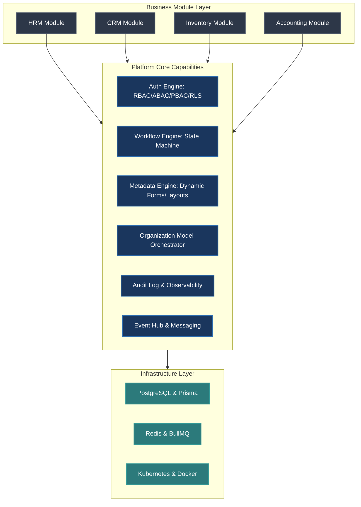
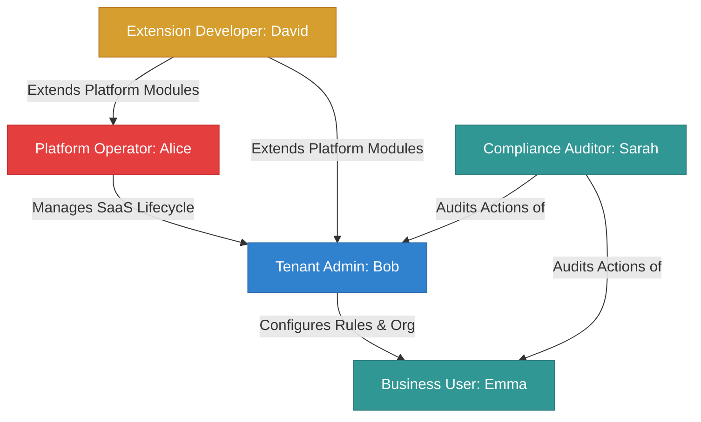

# Chapter 1: Vision & Product Requirement Document (PRD)

## 1. Executive Summary

The **Atlas Enterprise Platform** is a next-generation, cloud-native Enterprise Management Platform (EMP) designed to support multi-tenant, large-scale organizations. Rather than delivering a single point solution (such as a standalone HRM or CRM system), Atlas provides a generic, highly-extensible **Platform Core** on top of which modular business domains can be dynamically hot-swapped, extended, and scaled. 

This document serves as the strategic blueprint for the product vision, defining the architectural philosophy, business objectives, success metrics, and user personas that will guide all downstream technical specifications.



---

## 2. Product Vision & Design Philosophy

The core vision of Atlas is to commoditize the repetitive plumbing of enterprise applications (authentication, granular authorization, workflows, org charts, audit trails, and UI rendering) so that business developers can focus exclusively on writing pure domain logic.

### 2.1. Architectural Philosophy: Modular Monolith First
The platform is designed as a **Modular Monolith first**, but engineered to be strictly **Microservice-ready**. 

*   **Why Modular Monolith First?** Starting with a distributed microservices architecture for a brand-new system introduces massive operational overhead, complex network failures, distributed transaction challenges (Sagas/2PC), and high infrastructure costs. A modular monolith enforces strict logical boundaries at the compile-time level (via isolated NestJS modules, separate database schemas, and decoupled domain events) while keeping the execution context in a single process.
*   **How We Ensure Microservice Readiness:**
    1.  **No Shared Databases:** Modules cannot perform cross-module SQL joins. If the HRM module needs to display accounting data, it must call an interface/API defined by the Accounting module or listen to its domain events.
    2.  **Asynchronous Communication:** Inter-module communication uses an asynchronous Event Hub (implemented locally via in-memory event emitters, but pluggable to Redis/BullMQ or Kafka).
    3.  **Strict Bounded Contexts:** Every module owns its database tables. In Prisma, we will represent these via separate schema files or clear folder structures to prevent tight coupling.

### 2.2. Core Design Principle: Everything is a Resource
In Atlas, we reject the notion of specialized, hardcoded entities. Instead, we model the system around a **Unified Resource Model**.

```
+------------------------------------------------------------+
|                       Resource Header                      |
|  - Resource ID (UUID v7)                                   |
|  - Tenant ID (UUID)                                        |
|  - Resource Type (e.g., "hrm.employee", "crm.deal")        |
|  - Owner ID / Creator ID                                   |
+------------------------------------------------------------+
|                       Resource Security                    |
|  - Classification Level (Public, Internal, Confidential)   |
|  - Active Security Policies                                |
+------------------------------------------------------------+
|                       Resource Body                        |
|  - System Attributes (Fixed schema defined by code)        |
|  - Dynamic Attributes (Metadata-defined custom fields)     |
+------------------------------------------------------------+
```

*   **The Concept:** An *Employee*, a *Project*, an *Asset*, a *Warehouse*, and an *Invoice* are all instances of a generic **Resource** type.
*   **Why?** By generalizing all business entities into a uniform Resource abstraction, the platform can build generic, reusable engine layers:
    *   **Unified Authorization (PBAC/ABAC):** A policy engine can evaluate `Allow Action: Read on Resource: hrm.employee WHERE resource.classification == 'Confidential' AND user.department == resource.department`. This single policy engine works across all current and future modules.
    *   **Unified Workflows:** A workflow can attach to *any* resource (e.g., approve an Employee's leave request or approve a CRM Deal).
    *   **Unified Audit Log:** Every mutation to *any* resource is logged via a generic Event Sourced or Change Data Capture (CDC) mechanism.
    *   **Unified Metadata System:** Users can append custom fields (e.g., adding "Vaccination Status" to an Employee or "Serial Number" to an Asset) without running database migrations or modifying the backend code.

### 2.3. Core Design Principle: Everything is a Module
No business logic resides in the Platform Core. The platform core provides the *runtime container* and *infra utilities*. 
*   Business modules (like HRM) are registered dynamically or statically.
*   Each module exposes its metadata, API endpoints, workflow definitions, and authorization requirements to the core.
*   Extending the platform only requires creating a new module folder and satisfying the core interfaces.

---

## 3. Business Goals

| Business Goal | Description | Architectural Enabler | Target KPI |
| :--- | :--- | :--- | :--- |
| **High Multi-Tenant Density** | Support thousands of isolated customers (tenants) efficiently on a single infrastructure deployment. | Shared-database logical isolation via PostgreSQL Row-Level Security (RLS) + optional dedicated schema isolation. | Tenant provisioning time < 3 seconds; low baseline infra cost per tenant (<$1/month). |
| **Rapid Customization** | Allow non-technical tenant administrators to customize forms, workflows, database schemas, and permissions without redeploying code. | Metadata Platform (Dynamic UI & Schemas) + Policy-based Authorization (PBAC) Engine. | Time-to-customization: Instantaneous (live updates upon metadata publish). |
| **Modular Extensibility** | Enable internal/external developers to build and plug in new business domains (e.g., Procurement) without touching core code. | Loose coupling via clean modular architecture, Event-Driven Architecture (EDA), and Plugin SDK. | Integration of new module requires 0 changes to the platform's compiled core binary. |
| **Enterprise Compliance Readiness** | Facilitate audits, secure sensitive customer data, and satisfy strict corporate governance requirements. | Security by Design, generic Audit Log Platform, Column-Level Security (CLS), and Row-Level Security (RLS). | 100% of mutation requests logged with cryptographic integrity; zero data leaks across tenants. |

---

## 4. Success Metrics

To measure the health, adoption, and performance of the Atlas Enterprise Platform, we split success metrics into two core dimensions: **Architectural & Operational KPIs** and **Developer Velocity KPIs**.

### 4.1. Architectural & Operational Metrics (SLAs & SLOs)
*   **API Response Latency:** 
    *   p95 latency < 80ms for read requests.
    *   p99 latency < 200ms for write mutations.
*   **Tenant Isolation Validation:** Zero instances of Tenant cross-talk or unauthorized data access. Any policy validation failure must raise a high-severity alert to SecOps.
*   **System Availability (Uptime):** 99.99% operational uptime across all core services (Auth, API Gateway, Policy Engine).
*   **System Elasticity:** Under sudden load increases (e.g., payroll batch runs, global clock-in events), the system must auto-scale horizontally in < 180 seconds.
*   **Disaster Recovery SLA:**
    *   Recovery Point Objective (RPO) < 5 minutes (data loss window).
    *   Recovery Time Objective (RTO) < 15 minutes (system restoration).

### 4.2. Developer Velocity Metrics
*   **Module Scaffold Time:** A senior developer must be able to scaffold a fully functional, basic business module (with CRUD endpoints, validation, and database mapping) in less than 4 hours using standard templates.
*   **Zero-Downtime Hot Deployments:** The core system must support rolling updates of individual business modules without disconnecting active sessions of unaffected modules.

---

## 5. System Scope

### 5.1. In-Scope: The Platform Core Capabilities
1.  **Identity & Access Management (IAM) Core:** OAuth2, JWT generation, MFA, and Federated SSO (SAML/OIDC).
2.  **Policy-Based Authorization Engine:** Evaluation of RBAC, ABAC, and PBAC conditions down to row and column levels.
3.  **Organization Model Engine:** Resolving the complex tree hierarchy of a modern enterprise (Companies, Divisions, Departments, Factories, Teams, etc.).
4.  **Workflow Engine:** State-machine engine governing resource lifecycles, escalations, timeouts, and multi-step approvals.
5.  **Metadata Platform:** The repository for dynamic UI layouts, form fields, validation schema definitions, and menu configurations.
6.  **Event Bus & Task Queue:** Internal event dispatcher and distributed background job queue (BullMQ/Redis).
7.  **Audit Platform:** Tamper-evident log capture for all state changes.

### 5.2. In-Scope: The Business Domain (First Module - HRM)
1.  **Core Employee Profile:** Basic personal info, contracts, employment status, reporting lines (integrating with the Org Model Engine).
2.  **Leave Management:** Request, approval workflow (integrating with the Workflow Engine), balances, policy rules (ABAC-driven).
3.  **Time & Attendance:** Shift planning, clock-in/out via APIs, timesheet generation, and reconciliation.
4.  **Compensation & Payroll Core:** Base pay rates, allowances, basic calculation configurations (ready to export to Accounting).

### 5.3. Explicitly Out-of-Scope (To Be Handled Later/Through Plugins)
1.  **Localized Payroll Tax Engines:** Complex, country-specific tax calculations (e.g., US IRS, Vietnamese PIT) will be deferred to localized external integration modules.
2.  **Hardware-Level Biometric Devices Management:** The system will expose APIs for clock-in data, but will not write native hardware drivers for biometric clocks.
3.  **Native Video/Audio Conferencing for HR Recruitment:** Focus is strictly on administrative enterprise logic; communications will rely on integrations (MS Teams, Zoom).

---

## 6. Stakeholders & User Personas

An enterprise platform must cater to diverse roles. Below are the key personas that dictate the design of both the backend capabilities and the frontend layout system.



### 6.1. Platform Operator (SaaS Administrator) - "Alice"
*   **Role:** Global SaaS Architect / Platform Owner.
*   **Objectives:** Keep the SaaS platform healthy, monitor resource consumption, manage billing/subscriptions, and approve extension modules listed on the marketplace.
*   **Key Needs:** Comprehensive cross-tenant telemetry dashboards, global security configurations, system performance metrics, tenant database migration tools.

### 6.2. Tenant Administrator (HR Director / IT Director) - "Bob"
*   **Role:** Lead Administrator of an individual corporate tenant (e.g., "Acme Corp").
*   **Objectives:** Customize the platform to map Acme Corp's specific hierarchical structures, set up custom security policies, configure employee onboarding workflows, and add custom fields.
*   **Key Needs:** Simple, visual metadata builders (for forms, menus, and workflows), security policy editors, user role provisioning screens.

### 6.3. Standard Business User (Employee / Manager) - "Emma"
*   **Role:** Standard user (e.g., Senior Software Engineer at Acme Corp, or an Engineering Manager).
*   **Objectives:** File leave requests, log hours, view reporting lines, approve team member expenses, and view personal compensation statements.
*   **Key Needs:** Sleek, high-performance UI (Next.js) with micro-interactions, responsive mobile web layouts, notifications for approvals, clear task inbox.

### 6.4. Extension Developer (Systems Integrator / Partner) - "David"
*   **Role:** Backend/Full Stack Engineer writing custom plugins.
*   **Objectives:** Build a bespoke integration between Atlas and Acme Corp's legacy SAP ERP system.
*   **Key Needs:** Stable, versioned REST/GraphQL APIs, clear webhooks structure, standardized Plugin SDK, sandbox environment, mock data tools.

### 6.5. Compliance Auditor - "Sarah"
*   **Role:** Internal or External Security Officer checking corporate compliance.
*   **Objectives:** Trace history of payroll changes, view who accessed confidential records (Column-Level Security tracking), and verify workflow approvals.
*   **Key Needs:** Read-only access to chronological, queryable, non-repudiable audit logs.

---

## 7. Assumptions & Technical Risks

### 7.1. Critical Assumptions
1.  **Read-Heavy Ratio:** We assume a read-to-write ratio of roughly **85:15** in standard operational environments. However, peak write loads (e.g., 8:00 AM clock-in rush or monthly payroll generations) will cause concentrated spikes.
2.  **Relational Superiority:** The core system domain (Tenant, Org, Auth, Workflows) is highly relational. A relational database (PostgreSQL) is the correct foundation.
3.  **Modern Browser Domination:** The client application does not need to support legacy browsers (like IE11). We target modern evergreen browsers (Chrome, Safari, Edge, Firefox).

### 7.2. Technical Risks & Mitigations

| Identified Risk | Risk Severity | Potential Impact | Mitigation Strategy |
| :--- | :--- | :--- | :--- |
| **Performance Overhead of Metadata Engines** | High | Dynamic schemas and query builders can lead to slow execution times and bloated payloads. | Implement aggressive caching of metadata configurations in Redis. Compile dynamic layouts at the edge/build time where possible. Use strict validator patterns. |
| **Tenant Data Leaks (Noisy Neighbors / Bugs)** | Critical | Devastating security breach where Tenant A accesses Tenant B's confidential data. | Enforce row-level tenant security (RLS) at the database layer. Use a strict context-holder pattern in NestJS where every query implicitly appends the `tenant_id` context. Write isolated automated tests checking for tenant bleed-through. |
| **Distributed State Desynchronization** | Medium | Eventual consistency in event-driven modules could cause workflow and audit desynchronizations. | Implement outbox pattern for transactional events. Ensure all event handlers are idempotent. Provide reconciliation tasks for critical domains. |
| **Workflow Deadlocks / Infinite Loops** | Medium | Badly configured user workflows (e.g., A approves B, B approves A, or infinite validation loops). | Implement loop detection algorithms inside the workflow editor validation step. Enforce maximum transition depth checks at runtime. |

---

## 8. Architectural Alternatives Evaluated

### Alternative 1: Pure Microservices from Day 1
*   **Evaluation:** Rejected.
*   **Pros:** Independent scalability of each module, technology stack freedom per service.
*   **Cons:** Enormous DevOps complexity, complex tracing, high initial costs, difficulty refactoring boundary contexts as requirements shift.
*   **Trade-off Choice:** Modular Monolith offers the compile-time boundaries needed to easily split services later, without paying the network/distributed database tax on day one.

### Alternative 2: NoSQL (MongoDB/DynamoDB) for Metadata Core
*   **Evaluation:** Rejected.
*   **Pros:** Flexible schema out of the box makes storing dynamic metadata properties easy.
*   **Cons:** Weak support for complex transactional integrity, lacks robust native Row-Level Security (RLS) policies at the engine level, poor execution for highly relational organizational node structures.
*   **Trade-off Choice:** PostgreSQL handles both structured relational domains and semi-structured dynamic data (via `JSONB` columns) with high performance and transactional safety (ACID).

---

## 9. Future Roadmap & Extensibility Concepts
1.  **AI-Driven Business Intelligence Agents:** A generic agent module that uses semantic vectors of metadata definitions to let users ask natural language questions (e.g., *"How many employees in the Logistics department took leave last month?"*) and automatically formats the output into dynamic tables or dashboards.
2.  **Edge Compute Deployment:** Pushing the Tenant Cache and dynamic permission validation engines to Cloudflare Workers / AWS Lambda Edge to reduce round-trip authentication times to < 10ms globally.
3.  **Unified Marketplace:** Allowing third-party vendors to submit modules that adhere to our Core Interface, dynamically loaded at runtime using isolated sandboxing (WebAssembly or isolated Docker instances).
