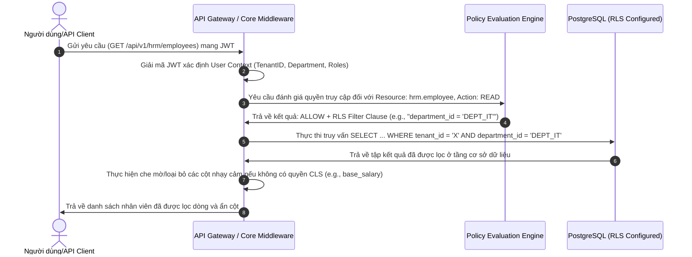

# Chương 2: Phân tích Nghiệp vụ (Business Analysis)

## 1. Yêu cầu Chức năng (Functional Requirements - FR)

Hệ thống được phân rã thành hai phân hệ chính: **Phân hệ Nền tảng (Platform Core)** và **Module Nghiệp vụ đầu tiên (Human Resource Management - HRM)**. Tất cả các tính năng của Core được thiết kế dưới dạng dịch vụ dùng chung (shared service) để các module nghiệp vụ trong tương lai (CRM, Inventory, Accounting...) có thể tái sử dụng trực tiếp.

### 1.1. Phân hệ Nền tảng (Platform Core)

#### 1.1.1. Quản lý Định danh & Đa thuê (IAM & Tenant Management)
*   **FR-IAM-01 (Tenant Onboarding):** Hệ thống phải cho phép khởi tạo một Tenant mới (doanh nghiệp khách hàng) một cách tự động thông qua API cấu hình. Quá trình này tự động tạo không gian làm việc cô lập, thiết lập tài khoản quản trị viên tối cao (Tenant Admin) đầu tiên.
*   **FR-IAM-02 (Authentication & SSO):** Hỗ trợ đăng nhập bằng tên người dùng/mật khẩu kết hợp Xác thực đa yếu tố (MFA). Hỗ trợ đăng nhập một lần (SSO) qua SAML 2.0 và OpenID Connect (OIDC) để tích hợp với Azure AD, Okta, hoặc Google Workspace của doanh nghiệp.
*   **FR-IAM-03 (Session & Token Lifecycle):** Quản lý vòng đời JWT (Access Token ngắn hạn, Refresh Token dài hạn lưu trong HttpOnly Cookie). Cơ chế thu hồi phiên làm việc (session revocation) tức thời trên toàn hệ thống khi phát hiện tài khoản bị xâm nhập hoặc khi đổi mật khẩu.

#### 1.1.2. Công cụ Phân quyền Động (Policy-based Access Control - PBAC Engine)
*   **FR-AUTHZ-01 (Resource & Action Registry):** Cung cấp cơ chế cho phép các Module tự đăng ký danh sách Resource của mình (ví dụ: `hrm.employee`, `hrm.leave_request`) và các Action hợp lệ (`create`, `read`, `update`, `delete`, `approve`).
*   **FR-AUTHZ-02 (Dynamic Policy Evaluation):** Đánh giá quyền truy cập dựa trên sự kết hợp giữa:
    *   **RBAC (Role-based):** Người dùng có vai trò gì (ví dụ: HR Manager).
    *   **ABAC (Attribute-based):** Điều kiện động dựa trên thuộc tính của User (ví dụ: Phòng ban của user) và thuộc tính của Resource (ví dụ: Trạng thái của đơn xin nghỉ phép).
    *   **PBAC (Policy-based):** Luật phân quyền được định nghĩa dưới dạng JSON/DSL (Domain Specific Language) linh hoạt.
*   **FR-AUTHZ-03 (Row-Level & Column-Level Security - RLS/CLS):**
    *   *RLS:* Lọc tự động các dòng dữ liệu mà người dùng không có quyền truy cập (ví dụ: Chỉ cho phép Trưởng phòng xem hồ sơ nhân viên thuộc phòng ban mình quản lý).
    *   *CLS:* Ẩn hoặc mã hóa/che mờ (masking) các cột dữ liệu nhạy cảm (ví dụ: Cột `base_salary` chỉ hiển thị cho HR Payroll và Giám đốc).



#### 1.1.3. Mô hình Tổ chức Tổng quát (Organization Model Engine)
*   **FR-ORG-01 (Flexible Node Hierarchy):** Cho phép cấu hình cây tổ chức không giới hạn cấp độ với các loại nút (Node Type) tùy biến: Công ty, Chi nhánh, Khối, Phòng ban, Tổ, Nhóm, Nhà máy, Kho hàng, Bệnh viện, Trường học...
*   **FR-ORG-02 (Matrix Reporting):** Hỗ trợ cấu hình báo cáo đa chiều (Ví dụ: Một nhân viên vừa báo cáo trực tiếp cho Trưởng phòng IT nội bộ, vừa báo cáo theo dự án cho Product Owner ở chi nhánh nước ngoài).
*   **FR-ORG-03 (Temporal Organization Structure):** Lưu vết lịch sử thay đổi của sơ đồ tổ chức (Time-traveling Org Chart). Cho phép truy vấn cấu trúc tổ chức tại một thời điểm bất kỳ trong quá khứ phục vụ cho việc tính lương lịch sử hoặc kiểm toán.

#### 1.1.4. Động cơ Quy trình (Workflow Engine)
*   **FR-WF-01 (Visual State Machine):** Cho phép thiết kế quy trình dưới dạng các trạng thái (States) và bước chuyển (Transitions). Mỗi bước chuyển có thể kích hoạt bởi sự kiện hoặc thao tác thủ công.
*   **FR-WF-02 (Dynamic Approval Routing):** Định tuyến phê duyệt động dựa trên sơ đồ tổ chức (ví dụ: Chuyển lên quản lý trực tiếp -> chuyển lên Trưởng phòng nhân sự -> Giám đốc khối).
*   **FR-WF-03 (Timeout, Reminder & Escalation):**
    *   Tự động gửi email/thông báo nhắc nhở khi quá hạn phê duyệt (Reminder).
    *   Tự động chuyển tiếp đơn lên cấp trên (Escalation) hoặc tự động bác bỏ/phê duyệt (Timeout Action) sau thời gian cấu hình (ví dụ: 48 giờ).
*   **FR-WF-04 (Delegation):** Cho phép người phê duyệt uỷ quyền tạm thời cho người khác trong một khoảng thời gian xác định (ví dụ: Khi đi công tác).

#### 1.1.5. Nền tảng Dữ liệu Đặc tả (Metadata Platform)
*   **FR-META-01 (Dynamic Attribute Definition):** Cho phép định nghĩa thêm trường thông tin cho bất kỳ Resource nào mà không cần chạy SQL Migration (ví dụ: Thêm trường `passport_number` vào `hrm.employee`). Hỗ trợ nhiều kiểu dữ liệu (Text, Number, Date, JSON, Reference to other resource).
*   **FR-META-02 (Dynamic UI Schema Registry):** Lưu trữ cấu hình cách hiển thị Form (thứ tự ô nhập liệu, validate bắt buộc/định dạng) và Table (danh sách cột hiển thị, tìm kiếm, lọc) dưới dạng JSON Schema phục vụ Frontend render động.

#### 1.1.6. Nhật ký Kiểm toán & Quan sát (Audit Log Engine)
*   **FR-AUDIT-01 (Change Data Capture - CDC Log):** Tự động ghi lại toàn bộ lịch sử thay đổi trạng thái của mọi Resource (Ai sửa, sửa khi nào, giá trị cũ là gì, giá trị mới là gì).
*   **FR-AUDIT-02 (Access Auditing):** Ghi nhận nhật ký mỗi khi người dùng truy cập hoặc đọc các thông tin Confidential (như xem bảng lương, xem số CCCD).
*   **FR-AUDIT-03 (Tamper-Evidence):** Đảm bảo log kiểm toán được lưu trữ tập trung, chỉ ghi (append-only), không thể chỉnh sửa hoặc xóa bởi bất kỳ ai kể cả Tenant Admin.

---

### 1.2. Module Nghiệp vụ: Quản lý Nhân sự (Human Resource Management - HRM)

Mặc dù được phát triển độc lập, Module HRM sử dụng các Engine dùng chung của Platform Core để vận hành nghiệp vụ.

```
+-----------------------------------------------------------------------------------+
|                                  HRM Module                                       |
+-------------------+--------------------+--------------------+---------------------+
| Employee Profile  |  Leave Management  | Time & Attendance  |    Payroll Core     |
+-------------------+--------------------+--------------------+---------------------+
                                     |
                                     v (Sử dụng hạ tầng dùng chung)
+-----------------------------------------------------------------------------------+
|                                Platform Core                                      |
+-------------------+--------------------+--------------------+---------------------+
| Org Model Engine  |  Workflow Engine   | PBAC/AuthZ Engine  |  Metadata Engine    |
+-------------------+--------------------+--------------------+---------------------+
```

#### 1.2.1. Quản lý Hồ sơ Nhân viên (Employee Profile)
*   **FR-HRM-EMP-01 (Employee Lifecycle):** Quản lý vòng đời nhân viên từ lúc thử việc (Onboarding), chính thức, luân chuyển bộ phận, cho đến khi nghỉ việc (Offboarding).
*   **FR-HRM-EMP-02 (Employment Contracts):** Quản lý danh sách hợp đồng lao động, phụ lục hợp đồng, cảnh báo hết hạn hợp đồng tự động trước 30 ngày.
*   **FR-HRM-EMP-03 (Reporting Hierarchy Integration):** Đồng bộ trực tiếp sơ đồ báo cáo của nhân viên vào cây sơ đồ tổ chức của hệ thống Core.

#### 1.2.2. Quản lý Nghỉ phép (Leave Management)
*   **FR-HRM-LV-01 (Leave Policy Configuration):** Cấu hình các loại phép (Phép năm, Nghỉ thai sản, Nghỉ ốm đau, Nghỉ không lương) và các quy tắc đi kèm (công thức tích lũy ngày phép hàng tháng, giới hạn số ngày nghỉ tối đa liên tục).
*   **FR-HRM-LV-02 (Leave Balance Calculator):** Tự động tính toán số ngày phép được nghỉ, số ngày phép đã nghỉ, số ngày phép còn lại của từng nhân viên theo thời gian thực.
*   **FR-HRM-LV-03 (Leave Request Workflow):** Cho phép nhân viên tạo đơn xin nghỉ phép trên giao diện web/mobile. Đơn này tự động kích hoạt luồng phê duyệt (Workflow Engine) được cấu hình cho phòng ban của nhân viên đó.

#### 1.2.3. Chấm công & Quản lý Ca làm việc (Time & Attendance)
*   **FR-HRM-TA-01 (Shift Scheduling):** Quản lý danh sách ca làm việc (ca hành chính, ca gãy, ca đêm), phân ca làm việc linh hoạt cho cá nhân hoặc cả nhóm/phòng ban theo tuần/tháng.
*   **FR-HRM-TA-02 (Check-in/out & Validation):** Hỗ trợ nhận dữ liệu chấm công từ nhiều nguồn: ứng dụng web/mobile (sử dụng GPS và mạng Wi-Fi được cấu hình trước), file dữ liệu thô từ máy chấm công vân tay/khuôn mặt.
*   **FR-HRM-TA-03 (Timesheet Generation):** Tự động đối soát dữ liệu Check-in/out thô với lịch phân ca để tính toán số giờ làm việc thực tế, số giờ làm thêm (OT), số lần đi muộn/về sớm, tạo ra bảng công tháng (Timesheet).

#### 1.2.4. Tính lương Cơ bản (Payroll Core)
*   **FR-HRM-PR-01 (Salary Formula Engine):** Cho phép Tenant Admin tự định nghĩa công thức tính lương thông qua một bộ biên dịch công thức động (ví dụ: `Thực lĩnh = Lương cơ bản * (Ngày công thực tế / Ngày công chuẩn) + Phụ cấp - Khấu trừ bảo hiểm`).
*   **FR-HRM-PR-02 (Payroll Run Execution):** Khởi chạy chu kỳ tính lương hàng tháng. Hệ thống tự động thu thập dữ liệu từ Hợp đồng lao động (mức lương cơ bản), bảng công Timesheet (số ngày làm việc), và các khoản giảm trừ để tính toán chi tiết bảng lương cho toàn bộ nhân viên.
*   **FR-HRM-PR-03 (Payslip Distribution & Approvals):** Bảng lương sau khi tính toán được gửi duyệt qua Workflow Engine. Sau khi được duyệt, hệ thống tự động khóa bảng lương và phân phối phiếu lương điện tử (Payslip) bảo mật đến từng nhân viên qua cổng thông tin cá nhân.

---

## 2. Yêu cầu Phi chức năng (Non-Functional Requirements - NFR)

Tài liệu NFR xác định các chỉ số đo lường chất lượng kỹ thuật mà hệ thống phải đáp ứng để đảm bảo tính ổn định và an toàn khi vận hành ở quy mô doanh nghiệp lớn.

| Tiêu chuẩn NFR | Chỉ số đo lường chi tiết | Cách thức hiện thực hóa (Kiến trúc) |
| :--- | :--- | :--- |
| **Độ tin cậy & Sẵn sàng (Reliability & Availability)** | - Uptime tối thiểu **99.99%** hàng năm.<br>- RTO (Recovery Time Objective) < 15 phút.<br>- RPO (Recovery Point Objective) < 5 phút. | - Triển khai Multi-AZ trên AWS.<br>- Cấu hình backup liên tục cho PostgreSQL (PITR - Point-in-Time Recovery).<br>- Cấu hình Auto-healing trên Kubernetes Pods. |
| **Hiệu năng & Khả năng đáp ứng (Performance)** | - p95 response time cho các API đọc dữ liệu < 80ms.<br>- p99 response time cho các API ghi dữ liệu < 200ms.<br>- Hỗ trợ tối thiểu 5,000 requests/second (RPS) đồng thời tại thời điểm cao điểm. | - Cache dữ liệu phân quyền và metadata cấu hình trên Redis cluster.<br>- Sử dụng Read Replicas của PostgreSQL cho các API chỉ đọc.<br>- Tối ưu hóa Database Indexing nâng cao. |
| **Khả năng co giãn (Scalability)** | - Hệ thống tự động scale-out không giới hạn khi CPU/Memory của Web Server vượt ngưỡng 70% trong 2 phút.<br>- Khả năng lưu trữ dữ liệu tăng trưởng 10TB mỗi năm mà không giảm hiệu năng truy vấn. | - Thiết kế Web Server hoàn toàn Stateless.<br>- Sử dụng Kubernetes HPA (Horizontal Pod Autoscaler).<br>- Lập kế hoạch phân vùng bảng (Table Partitioning) theo `tenant_id` và theo năm cho các bảng nhật ký/dữ liệu lớn. |
| **Khả năng bảo trì & mở rộng (Maintainability)** | - Triển khai một Module nghiệp vụ mới hoặc plugin mở rộng không yêu cầu thay đổi cơ sở dữ liệu lõi hoặc build lại Core Platform.<br>- Tỷ lệ bao phủ kiểm thử tự động (Unit Test Coverage) đạt tối thiểu **85%**. | - Áp dụng kiến trúc Clean Architecture & Hexagonal Architecture ở cấp độ Module.<br>- Quản lý cấu hình dạng Metadata và sử dụng Dependency Injection lỏng để đăng ký Module. |
| **Bảo mật dữ liệu (Data Security)** | - Mã hóa dữ liệu trên đường truyền (TLS 1.3) và dữ liệu tĩnh (AES-256 ở tầng DB).<br>- Tuân thủ quy định bảo vệ dữ liệu cá nhân Nghị định 13/2023/NĐ-CP (Mã hóa các trường thông tin nhạy cảm: CCCD, Điện thoại, Email trong PostgreSQL). | - Triển khai mã hóa cấp ứng dụng (Application-Level Encryption - ALE) đối với dữ liệu cá nhân nhạy cảm trước khi ghi xuống database.<br>- Sử dụng AWS KMS hoặc HashiCorp Vault để quản lý khóa mã hóa. |

---

## 3. Quy tắc Nghiệp vụ (Business Rules - BR)

Các quy tắc nghiệp vụ cốt lõi này là bất biến và bắt buộc phải được thực thi một cách nhất quán ở mọi tầng của hệ thống (API, Domain Service, Database Layer).

*   **BR-CORE-01 (Tenant Boundary):** Dữ liệu của một Tenant phải được cô lập vật lý hoặc logic tuyệt đối. Không có bất kỳ API, truy vấn hay tiến trình chạy ngầm nào được phép đọc/ghi dữ liệu của hai Tenant khác nhau trong cùng một luồng thực thi (execution context), trừ tiến trình thuộc quyền quản trị tối cao của Platform Operator (Alice).
*   **BR-AUTH-02 (Strict Principle of Least Privilege):** Mọi quyền truy cập mặc định là bị CẤM (Deny by Default). Người dùng chỉ có quyền thực hiện một hành động trên một resource cụ thể khi và chỉ khi có ít nhất một Policy phân quyền hợp lệ trả về kết quả ALLOW và không bị ghi đè bởi bất kỳ luật DENY nào.
*   **BR-WF-03 (Anti-Deadlock in Workflows):** Một sơ đồ quy trình workflow khi cấu hình bắt buộc phải đi qua công cụ kiểm tra tính chu kỳ (Cycle Detection). Không được phép kích hoạt một quy trình có chứa vòng lặp vô hạn (ví dụ: A duyệt chuyển cho B, B duyệt chuyển lại cho A). Số bước duyệt tối đa cho một quy trình giới hạn ở mức 20 bước.
*   **BR-HRM-04 (Leave Balance Enforcer):** Đơn xin nghỉ phép của nhân viên chỉ được phép gửi lên hệ thống khi số ngày nghỉ đề xuất nhỏ hơn hoặc bằng số dư ngày phép hiện tại (Leave Balance), ngoại trừ trường hợp chọn loại phép "Nghỉ không lương".
*   **BR-HRM-05 (Timesheet Lock):** Bảng công tháng của nhân viên sau khi đã chuyển sang trạng thái "Approved" hoặc "Locked" sẽ khóa toàn bộ các bản ghi chấm công thô liên quan của tháng đó. Không ai được phép thay đổi, chỉnh sửa dữ liệu check-in/out của tháng đã khóa trừ khi có sự phê duyệt đặc biệt từ Giám đốc Nhân sự thông qua quy trình phê duyệt khôi phục (Reopen Workflow).

---

## 4. Ràng buộc Hệ thống (Constraints)

*   **Ràng buộc Công nghệ (Technical Constraints):**
    *   *Backend:* Phải xây dựng trên NestJS Framework, sử dụng TypeScript.
    *   *Database ORM:* Sử dụng Prisma Client để giao tiếp với PostgreSQL. Không sử dụng các tính năng liên kết bảng (Relation) dạng hardcoded ở mức vật lý giữa các Module khác nhau để đảm bảo khả năng tách dịch vụ sau này.
    *   *Database:* PostgreSQL phiên bản 15 trở lên.
    *   *Caching & Queue:* Sử dụng Redis Cluster và BullMQ làm hệ thống hàng đợi tác vụ nền.
    *   *Frontend:* Xây dựng ứng dụng đơn trang sử dụng Next.js App Router.
*   **Ràng buộc Triển khai (Deployment Constraints):**
    *   Toàn bộ hệ thống phải được đóng gói bằng Docker Container.
    *   Hạ tầng phải được định nghĩa bằng Terraform (Infrastructure as Code) để dễ dàng nhân bản và tự động hóa triển khai trên AWS Cloud.
*   **Ràng buộc Quy định Pháp lý (Compliance Constraints):**
    *   Hệ thống phải lưu trữ lịch sử kiểm toán trong vòng tối thiểu 5 năm để đáp ứng các quy định thanh tra tài chính và bảo mật doanh nghiệp.
    *   Toàn bộ dữ liệu cá nhân của người dùng tại thị trường Việt Nam phải được lưu giữ trên các máy chủ đặt tại lãnh thổ Việt Nam để tuân thủ Luật An ninh mạng và Nghị định 13.

---

## 5. Câu chuyện Người dùng (User Stories)

Dưới đây là các câu chuyện người dùng cốt lõi mô tả cách thức người dùng tương tác với hệ thống:

### 5.1. Vai trò: Nhân viên (Standard User) - Emma
*   **US-EMP-01 (Leave Request):** Là một nhân viên, tôi muốn đệ trình đơn xin nghỉ phép năm thông qua ứng dụng di động, để tôi có thể nghỉ ngơi mà vẫn đảm bảo quy trình phê duyệt của công ty được thực hiện tự động.
*   **US-EMP-02 (Check-in/out):** Là một nhân viên làm việc tại văn phòng, tôi muốn thực hiện chấm công Check-in/out bằng ứng dụng di động khi kết nối vào Wi-Fi của công ty, để hệ thống tự động ghi nhận ngày công của tôi một cách chính xác mà không cần dùng máy quẹt thẻ thẻ từ.

### 5.2. Vai trò: Quản lý bộ phận (Manager) - Emma (vai trò quản lý)
*   **US-MGR-01 (Approve Leave):** Là một Trưởng phòng IT, tôi muốn nhận được thông báo tức thời (Push Notification/Email) khi nhân viên của tôi gửi đơn xin nghỉ phép, để tôi có thể xem xét và phê duyệt/bác bỏ đơn đó ngay lập tức nhằm không ảnh hưởng đến tiến độ dự án.
*   **US-MGR-02 (Timesheet Review):** Là một Quản lý bộ phận, tôi muốn xem bảng công tổng hợp hàng tuần của các thành viên trong nhóm, để tôi phát hiện sớm các trường hợp đi muộn/về sớm bất thường và điều chỉnh ca làm việc kịp thời.

### 5.3. Vai trò: Quản trị viên doanh nghiệp (Tenant Admin) - Bob
*   **US-TAD-01 (Dynamic Attribute Registration):** Là Quản trị viên hệ thống của Acme Corp, tôi muốn thêm một trường thông tin "Nhóm máu" vào hồ sơ nhân viên thông qua giao diện cấu hình, để chúng tôi có thông tin cấp cứu kịp thời cho nhân viên khi xảy ra tai nạn lao động mà không cần yêu cầu đội ngũ IT lập trình lại hệ thống.
*   **US-TAD-02 (SSO Integration):** Là IT Director của Acme Corp, tôi muốn cấu hình tích hợp đăng nhập SSO với Azure AD của tập đoàn, để nhân viên của tôi có thể sử dụng tài khoản email công ty đăng nhập trực tiếp vào Atlas mà không cần quản lý thêm một mật khẩu khác.

### 5.4. Vai trò: Chuyên viên Tuân thủ & Bảo mật (Compliance Auditor) - Sarah
*   **US-AUD-01 (Audit Trail Inspection):** Là một Kiểm toán viên nội bộ, tôi muốn truy xuất nhật ký thay đổi của một bảng lương nhân viên cụ thể, để tôi xác định chính xác ai đã thực hiện thay đổi mức lương của nhân viên đó, thay đổi khi nào và dựa trên cơ sở phê duyệt nào.

---

## 6. Đặc tả Trường hợp Sử dụng (Use Cases)

### 6.1. Use Case 1: Đệ trình & Duyệt Đơn xin Nghỉ phép (Leave Request Approval Workflow)

*   **Tác nhân chính (Actor):** Nhân viên (Emma - Người gửi yêu cầu), Quản lý bộ phận (Emma - Người phê duyệt).
*   **Tiền điều kiện (Pre-conditions):**
    1.  Nhân viên đã đăng nhập thành công vào hệ thống.
    2.  Nhân viên có số dư ngày phép năm (Leave Balance) lớn hơn 0.
    3.  Quy trình phê duyệt nghỉ phép của phòng ban đã được cấu hình trước đó trong Workflow Engine.
*   **Hậu điều kiện (Post-conditions):**
    1.  Đơn xin nghỉ phép được cập nhật trạng thái cuối cùng là "Approved" hoặc "Rejected".
    2.  Nếu được phê duyệt, số dư ngày nghỉ phép của nhân viên tự động bị trừ đi tương ứng.
    3.  Lịch công tác của nhân viên được cập nhật trạng thái "Nghỉ phép" để các phòng ban khác tiện theo dõi.
    4.  Nhật ký kiểm toán ghi nhận toàn bộ bước chuyển trạng thái của quy trình.

#### 6.1.1. Luồng sự kiện chính (Basic Flow)

| Bước | Tác nhân thực hiện | Hành động của hệ thống |
| :--- | :--- | :--- |
| **1** | Nhân viên | Chọn chức năng "Xin nghỉ phép", điền thông tin: Loại phép (Nghỉ phép năm), Ngày bắt đầu, Ngày kết thúc, Lý do nghỉ phép, và nhấn gửi. |
| **2** | Hệ thống | Gọi API kiểm tra số dư phép còn lại của nhân viên. Đảm bảo số ngày xin nghỉ hợp lệ (áp dụng quy tắc `BR-HRM-04`). |
| **3** | Hệ thống | Khởi tạo một thực thể quy trình mới (Workflow Instance) liên kết với Đơn xin nghỉ phép (Resource: `hrm.leave_request`). |
| **4** | Hệ thống | Phân tích Org Chart để tìm Quản lý trực tiếp (Manager) của Nhân viên đó và tạo một nhiệm vụ phê duyệt (Approval Task) cho Manager. |
| **5** | Hệ thống | Gửi email nhắc và thông báo đẩy (Push Notification) đến thiết bị của Manager. Đơn xin nghỉ phép chuyển sang trạng thái `PENDING_APPROVAL`. |
| **6** | Manager | Mở ứng dụng, xem chi tiết đơn xin nghỉ phép, và chọn "Approve". |
| **7** | Hệ thống | Đánh giá điều kiện chuyển trạng thái. Xác nhận đây là bước phê duyệt cuối cùng của quy trình. |
| **8** | Hệ thống | Cập nhật trạng thái đơn xin nghỉ phép thành `APPROVED`. |
| **9** | Hệ thống | Tự động thực thi hành động sau phê duyệt (Post-approval action): Khấu trừ số dư phép của nhân viên, gửi thông báo chúc kỳ nghỉ vui vẻ đến nhân viên. |
| **10**| Hệ thống | Ghi vết toàn bộ luồng phê duyệt vào hệ thống Nhật ký Kiểm toán (Audit Log). |

#### 6.1.2. Luồng thay thế (Alternative Flows)

*   **Luồng thay thế A: Số dư phép không đủ**
    *   *Tại bước 2:* Hệ thống phát hiện số dư phép năm của nhân viên nhỏ hơn số ngày xin nghỉ.
    *   *Hệ thống:* Từ chối tạo đơn, hiển thị thông báo lỗi: *"Số dư phép năm không đủ để thực hiện yêu cầu. Bạn chỉ còn lại X ngày phép. Vui lòng chuyển sang Nghỉ không lương hoặc điều chỉnh thời gian nghỉ."*
*   **Luồng thay thế B: Manager từ chối đơn (Reject)**
    *   *Tại bước 6:* Manager chọn "Reject" và nhập lý do từ chối: *"Dự án đang vào giai đoạn nước rút, không thể nghỉ thời điểm này."*
    *   *Hệ thống:* Cập nhật trạng thái đơn thành `REJECTED`, gửi thông báo cho Nhân viên kèm theo lý do từ chối của Manager, quy trình kết thúc mà không khấu trừ số dư ngày phép.
*   **Luồng thay thế C: Quá hạn phê duyệt (Timeout Escalation)**
    *   *Tại bước 5:* Sau 48 giờ ở trạng thái `PENDING_APPROVAL` mà Manager không thực hiện hành động.
    *   *Hệ thống:* Kích hoạt cơ chế kiểm soát thời gian của Workflow Engine. Tự động chuyển đơn lên cấp quản lý cao hơn của Manager (ví dụ: Giám đốc bộ phận) và gửi thông báo khẩn cấp kèm nhãn `ESCALATED`.

---

### 6.2. Use Case 2: Cấu hình và Áp dụng Trường Dữ liệu Động (Dynamic Attribute Extension)

*   **Tác nhân chính (Actor):** Quản trị viên doanh nghiệp (Tenant Admin - Bob).
*   **Tiền điều kiện (Pre-conditions):**
    1.  Bob có quyền truy cập vào bảng điều khiển Quản trị hệ thống (được xác thực qua PBAC).
*   **Hậu điều kiện (Post-conditions):**
    1.  Trường thông tin động mới được đăng ký thành công vào Metadata Platform của Tenant đó.
    2.  Người dùng khi mở form tạo mới/chỉnh sửa Hồ sơ nhân viên nhìn thấy trường thông tin mới này ngay lập tức.
    3.  Dữ liệu nhập vào trường mới được lưu trữ an toàn trong PostgreSQL và có thể truy vấn bình thường.

#### 6.2.1. Luồng sự kiện chính (Basic Flow)

| Bước | Tác nhân thực hiện | Hành động của hệ thống |
| :--- | :--- | :--- |
| **1** | Tenant Admin | Truy cập menu "Quản lý dữ liệu đặc tả", chọn cấu hình thực thể "Hồ sơ nhân viên" (`hrm.employee`). |
| **2** | Tenant Admin | Nhấn "Thêm trường dữ liệu", định nghĩa thông số: Tên hiển thị (Số CMND/CCCD), Khóa dữ liệu (`identity_card_number`), Kiểu dữ liệu (Chuỗi ký tự), Định dạng kiểm tra (Regex kiểm tra 12 chữ số), Cấp độ bảo mật (Confidential). |
| **3** | Hệ thống | Thực hiện kiểm tra tính hợp lệ của trường đăng ký (không trùng khóa dữ liệu hệ thống, cú pháp Regex chuẩn). |
| **4** | Hệ thống | Ghi nhận cấu hình metadata mới này vào bảng chứa Metadata Schema của Tenant. Refresh cache Metadata của Tenant đó trên Redis. |
| **5** | Nhân sự (HR Staff) | Mở giao diện "Thêm mới Nhân viên" trên Next.js App. |
| **6** | Hệ thống | Gọi API lấy UI Schema của thực thể `hrm.employee` từ Metadata Platform (đã cache trên Redis). |
| **7** | Hệ thống | Frontend tự động dựng giao diện (render động) bổ sung thêm ô nhập liệu "Số CMND/CCCD" dựa trên UI Schema nhận được. |
| **8** | Nhân sự (HR Staff) | Nhập liệu đầy đủ thông tin nhân viên bao gồm cả ô "Số CMND/CCCD" mới và nhấn Lưu. |
| **9** | Hệ thống | Thực thi bộ kiểm định động (Dynamic Validator) ở Backend, đối chiếu giá trị nhập vào với Regex đã cấu hình tại Bước 2. |
| **10**| Hệ thống | Mã hóa giá trị "Số CMND/CCCD" bằng khóa AES-256 của Tenant (do đây là cột nhạy cảm - Confidential) và lưu trữ giá trị vào cột JSONB mở rộng của bảng nhân viên trong DB. |
