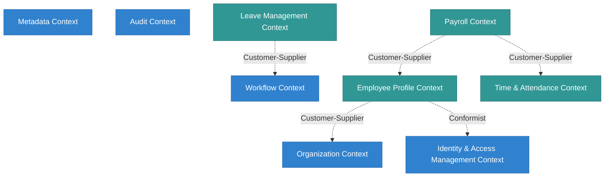

# Chương 3: Phân tích Miền (Domain Analysis)

## 1. Ngôn ngữ Chung (Ubiquitous Language)

Để đảm bảo sự nhất quán trong giao tiếp giữa chuyên gia nghiệp vụ (Domain Experts) và đội ngũ phát triển, hệ thống định nghĩa một bảng thuật ngữ chuẩn hóa:

| Thuật ngữ gốc | Thuật ngữ tiếng Việt | Định nghĩa nghiệp vụ | Bối cảnh sử dụng |
| :--- | :--- | :--- | :--- |
| **Tenant** | Khách hàng đa thuê / Thuê chủ | Một doanh nghiệp hoặc thực thể khách hàng độc lập sở hữu một không gian làm việc bị cô lập dữ liệu hoàn toàn. | Toàn hệ thống |
| **Resource** | Tài nguyên | Mọi thực thể nghiệp vụ được định danh trong hệ thống (nhân viên, bảng lương, ca làm việc) mà hệ thống phân quyền quản lý. | Platform Core / AuthZ |
| **Identity** | Thực thể định danh | Thông tin đăng nhập vật lý của người dùng (tài khoản email, mật khẩu băm, cấu hình MFA). | IAM |
| **Principal** | Chủ thể | Một định danh hoạt động trong hệ thống đại diện cho User, Client Application, hoặc System Worker sau khi đã xác thực. | AuthZ / Security |
| **Organization Node** | Nút tổ chức | Một đơn vị cấu trúc trong cây sơ đồ tổ chức của doanh nghiệp (ví dụ: Phòng IT, Chi nhánh HN). | Org Model |
| **Workflow Schema** | Sơ đồ quy trình | Định nghĩa cấu hình luồng công việc bao gồm các trạng thái và điều kiện chuyển trạng thái. | Workflow |
| **Workflow Instance** | Thực thể quy trình | Một luồng công việc cụ thể đang chạy gắn với một Resource (ví dụ: Quy trình duyệt đơn xin nghỉ phép mã số #102). | Workflow |
| **Leave Balance** | Số dư ngày nghỉ | Số ngày nghỉ được phép sử dụng còn lại của một nhân viên trong năm đối với một loại phép cụ thể. | HRM - Leave |
| **Timesheet** | Bảng công tổng hợp | Bảng tổng hợp số giờ công thực tế, đi muộn, về sớm của một nhân viên trong một chu kỳ (thường là tháng). | HRM - Attendance |
| **Payroll Run** | Phiên tính lương | Tiến trình nền thu thập công, hợp đồng và công thức để tính toán bảng lương cho toàn bộ Tenant. | HRM - Payroll |

---

## 2. Bối cảnh Giới hạn (Bounded Contexts)

Hệ thống được chia nhỏ thành các Bounded Context độc lập về mặt nghiệp vụ và mô hình dữ liệu để đảm bảo tính module hóa:

---

## 3. Bản đồ Ngữ cảnh (Context Map) & Mối quan hệ

Các Bounded Context tương tác với nhau tuân theo các quy tắc tích hợp DDD nghiêm ngặt để tránh sự phụ thuộc chồng chéo (tight coupling):

1.  **IAM Context & Organization Context (Shared Kernel):**
    *   *Mối quan hệ:* Shared Kernel. Cả hai đều chia sẻ khái niệm chung về `User` và `Tenant ID`.
2.  **Platform Core (Supplier) & Business Modules (Customer):**
    *   *Mối quan hệ:* Customer-Supplier. Các module nghiệp vụ như HRM phụ thuộc hoàn toàn vào các Interface API do Platform Core cung cấp để thực thi phân quyền (AuthZ), lưu vết thay đổi (Audit), chạy quy trình duyệt (Workflow) và dựng layout (Metadata). Core cam kết không thay đổi API mà không có phiên bản (Versioning) hỗ trợ tương thích ngược.
3.  **Employee Context & IAM Context (Conformist):**
    *   *Mối quan hệ:* Conformist. Bối cảnh Nhân sự chấp nhận hoàn toàn định dạng User Principal do IAM tạo ra mà không cố gắng chuyển dịch hay thay đổi cấu trúc của nó.

---

## 4. Mô hình Miền (Domain Model) & Aggregates

Để bảo vệ tính toàn vẹn của dữ liệu (transactional boundaries), các thực thể được tổ chức thành các Aggregate Root. Dưới đây là đặc tả cấu trúc của các Aggregate quan trọng nhất:

### 4.1. Core Platform Bounded Contexts

#### 4.1.1. Tenant Aggregate
*   **Aggregate Root:** `Tenant`
*   **Entities:**
    *   `TenantSettings` (Lưu cấu hình múi giờ, ngôn ngữ, định dạng ngày tháng).
    *   `Subscription` (Quản lý trạng thái gói dịch vụ).
*   **Value Objects:**
    *   `TenantStatus` (Enum: Active, Suspended, Provisioning).
    *   `TenantDomain` (Địa chỉ truy cập phụ).

#### 4.1.2. Organization Aggregate
*   **Aggregate Root:** `OrgNode`
*   **Entities:**
    *   `OrgRelation` (Quản lý các mối quan hệ cha-con hoặc quan hệ ma trận).
    *   `Position` (Chức vụ gắn với Node, ví dụ: Trưởng phòng IT).
*   **Value Objects:**
    *   `NodeType` (Enum: Company, Branch, Department, Team...).

#### 4.1.3. Workflow Aggregate
*   **Aggregate Root:** `WorkflowSchema`
*   **Entities:**
    *   `State` (Các trạng thái của quy trình, ví dụ: Draft, Pending, Approved).
    *   `Transition` (Định nghĩa bước chuyển trạng thái và điều kiện kích hoạt).
    *   `ApprovalStep` (Quy định ai là người duyệt ở trạng thái này).
*   **Value Objects:**
    *   `WorkflowTrigger` (Điều kiện kích hoạt quy trình).

---

### 4.2. HRM Bounded Contexts

#### 4.2.1. Employee Aggregate
*   **Aggregate Root:** `Employee`
*   **Entities:**
    *   `EmploymentContract` (Hợp đồng lao động).
    *   `WorkHistory` (Lịch sử công tác).
    *   `EducationHistory` (Lịch sử học vấn).
*   **Value Objects:**
    *   `TaxIdentificationNumber` (Mã số thuế thu nhập cá nhân).
    *   `Address` (Địa chỉ thường trú/tạm trú).

#### 4.2.2. Leave Request Aggregate
*   **Aggregate Root:** `LeaveRequest`
*   **Entities:**
    *   `LeaveAllocation` (Bảng phân bổ ngày phép tích lũy).
*   **Value Objects:**
    *   `LeavePeriod` (Khoảng thời gian nghỉ gồm ngày bắt đầu và kết thúc).
    *   `LeaveType` (Enum: Annual, Sick, Maternity, Unpaid).

---

## 5. Dịch vụ Miền (Domain Services)

Khi một nghiệp vụ không thuộc về trách nhiệm của riêng một Entity hay Aggregate nào, nó được hiện thực hóa dưới dạng Domain Service không trạng thái (stateless):

1.  **`TenantProvisioningService` (Platform Core):**
    *   *Nhiệm vụ:* Khởi tạo cấu trúc dữ liệu cho một doanh nghiệp mới. Nó điều phối việc tạo cơ sở dữ liệu/schema riêng, khởi tạo Org chart mặc định, đăng ký các Roles hệ thống cơ bản, và thiết lập tài khoản quản trị Admin.
2.  **`PolicyEvaluationService` (Platform Core):**
    *   *Nhiệm vụ:* Tiếp nhận `UserContext`, `Resource`, và `Action`. Nó truy vấn tất cả các Policy đang hoạt động, thực hiện biên dịch các luật ABAC/PBAC và trả ra quyết định cuối cùng (`ALLOW` hay `DENY`) kèm theo điều kiện lọc dữ liệu RLS.
3.  **`PayrollCalculationService` (HRM Module):**
    *   *Nhiệm vụ:* Tổng hợp bảng công từ `Timesheet`, lấy thông tin lương từ `EmploymentContract`, gọi bộ biên dịch công thức động từ `Metadata Platform` để tính toán số tiền thực nhận cho từng nhân viên, đảm bảo tính toàn vẹn số liệu tài chính trước khi tạo phiên lương.

---

## 6. Sự kiện Miền (Domain Events)

Sự kiện miền thể hiện những thay đổi trạng thái quan trọng xảy ra trong hệ thống và được phát đi bất đồng bộ để các bối cảnh khác cập nhật thông tin:

| Tên Sự kiện | Nguồn phát (Publisher) | Bối cảnh tiêu thụ (Subscriber) | Ý nghĩa nghiệp vụ |
| :--- | :--- | :--- | :--- |
| `TenantProvisionedEvent` | Tenant Aggregate | Toàn hệ thống | Báo hiệu không gian Tenant mới đã sẵn sàng hoạt động. |
| `EmployeeCreatedEvent` | Employee Aggregate | IAM Context / Org Context | Kích hoạt tự động tạo tài khoản Identity (SSO/MFA) và cập nhật sơ đồ tổ chức. |
| `LeaveRequestApprovedEvent` | LeaveRequest Aggregate | Employee Aggregate / Payroll | Kích hoạt trừ số dư phép và đồng bộ ngày nghỉ vào hệ thống tính công/lương. |
| `OrgNodeChangedEvent` | OrgNode Aggregate | PBAC Context | Yêu cầu tính toán lại và xóa cache phân quyền của tất cả nhân viên thuộc Node bị ảnh hưởng. |

---

## 7. Kho lưu trữ (Repositories)

Các Aggregate Root giao tiếp với tầng dữ liệu thông qua các Interface Repository để đảm bảo tính độc lập với công nghệ ORM (Prisma/PostgreSQL):

*   **`ITenantRepository`:** Khai báo các phương thức đọc/ghi Tenant, cập nhật trạng thái gói dịch vụ.
*   **`IOrgRepository`:** Giải quyết các câu truy vấn đệ quy phức tạp trên cấu trúc cây Node (ví dụ: Lấy toàn bộ danh sách các Node con trực thuộc một Node cấp trên).
*   **`IEmployeeRepository`:** Cung cấp các hàm tìm kiếm nâng cao theo phòng ban, chức vụ, quản lý trực tiếp và xử lý mã hóa dữ liệu nhạy cảm (như CCCD).
*   **`IWorkflowInstanceRepository`:** Lưu trữ lịch sử trạng thái của từng bước duyệt, hỗ trợ truy vấn các công việc đang chờ xử lý của một User cụ thể.
