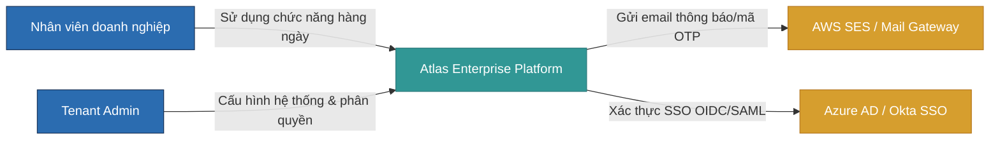
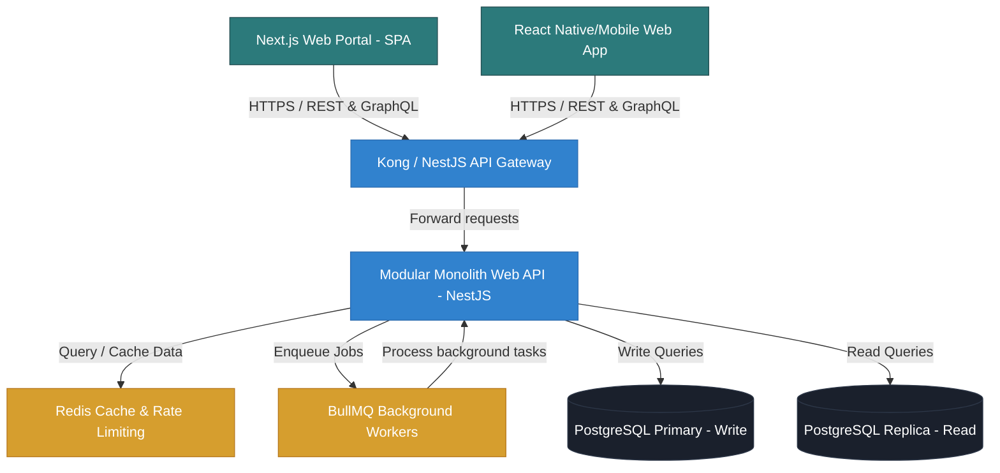
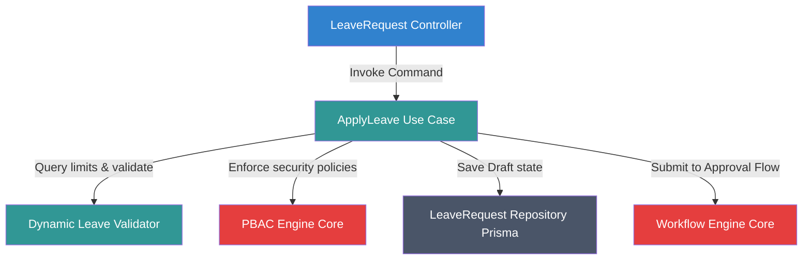
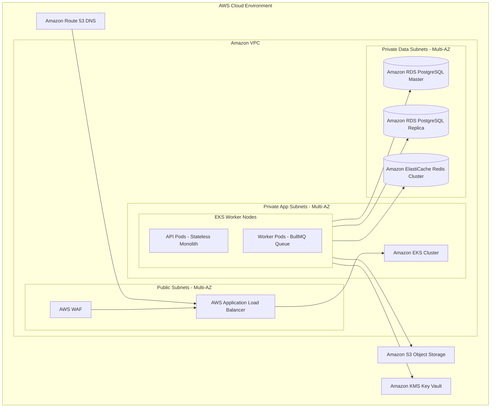
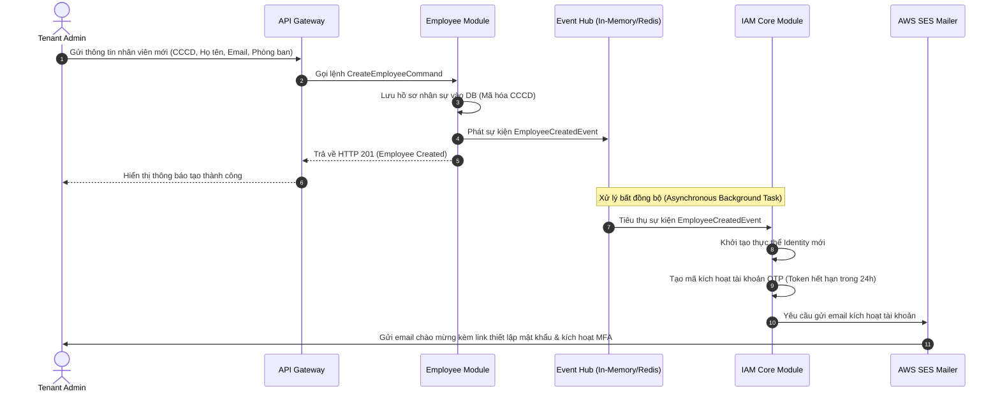

# Chương 4: Kiến trúc Phần mềm (Software Architecture)

## 1. Kiến trúc Đa tầng Logic (Logical Architecture - Clean Architecture)

Hệ thống áp dụng kiến trúc **Clean Architecture** kết hợp với **Hexagonal Architecture (Ports and Adapters)** trong từng Module để đảm bảo tính độc lập giữa logic nghiệp vụ cốt lõi và các tác nhân hạ tầng ngoại vi (Database, HTTP API, Message Queue).

```
+---------------------------------------------------------------------------------+
|                               Presentation Layer (REST/GraphQL)                 |
+---------------------------------------------------------------------------------+
|                               Application Layer (Use Cases / Commands / Queries)|
|   +-------------------------------------------------------------------------+   |
|   |                           Domain Layer (Entities, Value Objects,        |   |
|   |                            Domain Services, Repository Interfaces)      |   |
|   +-------------------------------------------------------------------------+   |
+---------------------------------------------------------------------------------+
|                               Infrastructure Layer (Prisma, Postgres, Redis, AWS)|
+---------------------------------------------------------------------------------+
```

1.  **Lớp Miền (Domain Layer - Cốt lõi):** Chứa các thực thể nghiệp vụ (Entities), Giá trị miền (Value Objects), Sự kiện (Domain Events), và Giao diện kho lưu trữ (Repository Interfaces). Lớp này hoàn toàn cô lập, không phụ thuộc vào bất kỳ thư viện hay framework nào khác (kể cả NestJS hay Prisma).
2.  **Lớp Ứng dụng (Application Layer):** Định nghĩa các luồng xử lý nghiệp vụ (Use Cases), CQRS Commands và Queries, các Service điều phối. Lớp này sử dụng các Interface định nghĩa ở lớp Domain và tương tác với bên ngoài qua các cổng (Ports).
3.  **Lớp Giao tiếp (Presentation/API Layer):** Xử lý các giao thức mạng (REST Controllers, GraphQL Resolvers, Request Validators, Serialization).
4.  **Lớp Hạ tầng (Infrastructure Layer):** Hiện thực hóa các Repository bằng Prisma Client, tích hợp Redis Caching, cấu hình gửi email qua AWS SES, và triển khai hàng đợi BullMQ.

---

## 2. Mô hình C4 (C4 Model)

Để mô tả kiến trúc ở các mức độ chi tiết khác nhau, chúng tôi sử dụng mô hình C4:

### 2.1. Cấp độ 1: Bối cảnh Hệ thống (System Context Diagram)
Mô tả cách người dùng và các hệ thống bên ngoài tương tác với Atlas Enterprise Platform.



### 2.2. Cấp độ 2: Container Diagram
Mô tả các thành phần thực thi độc lập (ứng dụng, cơ sở dữ liệu) tạo nên nền tảng.



### 2.3. Cấp độ 3: Component Diagram (Của Module HRM điển hình)
Mô tả cấu trúc nội bộ của Module HRM tích hợp với Platform Core.



---

## 3. Kiến trúc Vật lý & Triển khai (Deployment Architecture)

Hệ thống được triển khai theo mô hình Cloud-Native trên nền tảng Amazon Web Services (AWS) sử dụng Amazon Elastic Kubernetes Service (EKS) để quản lý container.



---

## 4. Luồng Thực thi Nghiệp vụ (Sequence Diagrams)

### 4.1. Quy trình Tuyển dụng và Khởi tạo Tài khoản (Onboarding & Identity Provisioning)
Mô tả luồng tương tác khi một nhân viên mới được tạo và hệ thống tự động thiết lập bảo mật.



---

## 5. Các Mẫu Giao tiếp (Communication Patterns)

Hệ thống áp dụng ba mô hình giao tiếp để tối ưu hóa hiệu năng và khả năng mở rộng:

1.  **Giao tiếp Đồng bộ nội bộ (Synchronous Internal Calls):**
    *   *Cách thực hiện:* Sử dụng cơ chế Dependency Injection của NestJS. Module A tiêm (Inject) Interface Service của Module B.
    *   *Ràng buộc:* Module A không bao giờ được phép trực tiếp thay đổi cơ sở dữ liệu của Module B. Mọi hành động ghi hoặc đọc chéo phải thông qua Service Interface.
2.  **Giao tiếp Bất đồng bộ dựa trên Sự kiện (Asynchronous Event-Driven):**
    *   *Cách thực hiện:* Sử dụng một Event Hub dùng chung. Khi một thay đổi trạng thái quan trọng xảy ra, module sở hữu sẽ phát đi một Event (ví dụ: `LeaveRequestApprovedEvent`). Các module khác đăng ký lắng nghe (Subscribe) sự kiện này để tự động cập nhật dữ liệu của mình.
    *   *Lợi ích:* Giảm thiểu tối đa sự phụ thuộc trực tiếp (decoupling), tăng tốc thời gian phản hồi API của luồng chính.
3.  **Hàng đợi Công việc nền (Distributed Task Queue):**
    *   *Cách thực hiện:* Sử dụng BullMQ kết hợp Redis.
    *   *Ứng dụng:* Các công việc tiêu tốn nhiều tài nguyên hoặc thời gian (ví dụ: Tính toán bảng lương cho 10,000 nhân viên, xuất file báo cáo PDF lớn, gửi email hàng loạt) sẽ được đẩy vào hàng đợi dưới dạng các Job và được xử lý tuần tự/song song bởi các Worker Pods riêng biệt.
