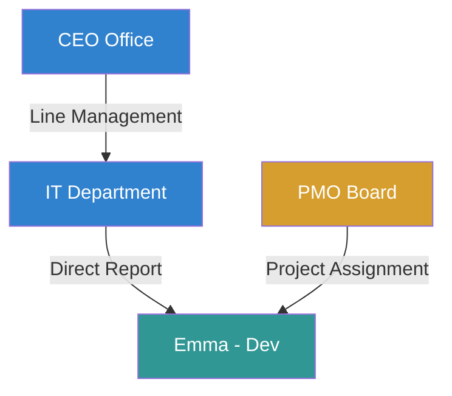

# Chương 6: Nền tảng Mô hình Tổ chức (Organization Platform)

## 1. Mô hình Tổ chức Tổng quát (Generic Organization Model)

Để tránh việc thiết kế cứng các cấp bậc tổ chức (làm hạn chế khả năng mở rộng sang các doanh nghiệp có cấu trúc phức tạp như nhà máy, bệnh viện, trường học), Atlas định nghĩa một mô hình tổ chức dưới dạng **Đồ thị Thực thể Động (Dynamic Entity Graph)**.

```
+-------------------------------------------------------------+
|                         OrgNode                             |
|  - id (UUID)                                                |
|  - tenant_id (UUID)                                         |
|  - type_id (UUID) --------> OrgNodeType                     |
|  - code (VARCHAR)            - code (VARCHAR, e.g., "DEPT") |
|  - name (VARCHAR)            - name (VARCHAR, e.g., "Phòng")|
+-------------------------------------------------------------+
                               |
                               v (Liên kết đệ quy)
+-------------------------------------------------------------+
|                       OrgRelation                           |
|  - id (UUID)                                                |
|  - parent_node_id (UUID)                                    |
|  - child_node_id (UUID)                                     |
|  - dimension_id (UUID) ---> OrgDimension                    |
|  - path (VARCHAR)            - code (e.g., "LINE", "PROJ")  |
+-------------------------------------------------------------+
```

*   **`OrgNode` (Nút Tổ chức):** Đại diện cho một đơn vị thực tế (ví dụ: Tập đoàn Atlas, Chi nhánh Sài Gòn, Nhà máy số 3, Kho hàng A, Phòng Lab Sinh học).
*   **`OrgNodeType` (Loại Nút):** Định nghĩa động các phân loại nút trong hệ thống. Quản trị viên tự định nghĩa danh mục này (Company, Branch, Division, Department, Team, Warehouse, Hospital, School...).
*   **`OrgDimension` (Chiều báo cáo):** Cho phép một Nút tham gia vào nhiều cấu trúc sơ đồ khác nhau (ví dụ: Chiều Báo cáo Hành chính - Line Management, Chiều Dự án - Project Management).
*   **`OrgRelation` (Quan hệ giữa các Nút):** Định nghĩa cấu hình liên kết cha-con giữa các nút trong một Chiều báo cáo xác định.

---

## 2. Giải pháp Lưu trữ Cây Thư mục (Tree Hierarchy Storage Pattern)

Việc truy vấn cấu trúc phân cấp (cây sơ đồ tổ chức) trong cơ sở dữ liệu quan hệ luôn là một thách thức lớn về mặt hiệu năng. Chúng tôi đánh giá ba giải pháp lưu trữ:

| Giải pháp lưu trữ | Cách thức hoạt động | Ưu điểm | Nhược điểm | Quyết định chọn lựa |
| :--- | :--- | :--- | :--- | :--- |
| **Adjacency List (Danh sách Kề)** | Mỗi Node lưu một cột `parent_id`. | - Đơn vị thiết kế đơn giản nhất.<br>- Thao tác ghi/cập nhật vị trí Node cực nhanh (chỉ cần đổi `parent_id`). | - Truy vấn lấy toàn bộ cây con (Subtree) rất chậm (phải sử dụng truy vấn đệ quy `WITH RECURSIVE` trong SQL). | **CHỌN (Kết hợp)**: Dùng để đảm bảo tính toàn vẹn khóa ngoại tham chiếu. |
| **Materialized Path (Đường dẫn Thực thể hóa)** | Mỗi Node lưu đường đi từ gốc đến nó dưới dạng chuỗi (ví dụ: `/root_id/node_a_id/node_b_id`). | - Lấy toàn bộ cây con cực kỳ nhanh bằng một câu lệnh `LIKE` (ví dụ: `path LIKE '/root_id/node_a_id/%'`). | - Thao tác di chuyển Node (Re-parenting) tốn hiệu năng do phải cập nhật lại chuỗi path của toàn bộ các Node con bên dưới. | **CHỌN (Kết hợp)**: Đây là giải pháp tối ưu cho hệ thống đọc nhiều hơn ghi (Read-Heavy). |
| **Nested Sets (Tập hợp Lồng nhau)** | Mỗi Node lưu hai giá trị số nguyên `lft` và `rgt` xác định phạm vi của nó. | - Truy vấn lấy cây con rất nhanh mà không cần đệ quy. | - Thao tác chèn hoặc cập nhật Node cực kỳ phức tạp và khóa bảng diện rộng vì phải tính toán lại chỉ số `lft`/`rgt` cho toàn bộ các node khác. | **LOẠI**: Không phù hợp cho môi trường doanh nghiệp năng động thường xuyên tái cấu trúc. |

> [!TIP]
> **Thiết kế kết hợp của Atlas:** Chúng tôi kết hợp **Adjacency List** (cho khóa ngoại tham chiếu thực tế) và **Materialized Path** (lưu trong cột `path` của bảng `OrgRelation`) để tận dụng ưu điểm của cả hai: Đảm bảo toàn vẹn dữ liệu ở tầng ghi và tối ưu hóa hiệu năng đọc ở tầng truy vấn danh sách nhân viên cấp dưới.

---

## 3. Quản lý Báo cáo Đa chiều (Multi-dimensional / Matrix Reporting)

Trong các tổ chức hiện đại, một nhân viên hoặc bộ phận không chỉ báo cáo cho một quản lý hành chính duy nhất mà còn báo cáo chéo theo dự án hoặc chức năng chuyên môn.



*   **Administrative Dimension (Cấu trúc Hành chính):** Đây là sơ đồ tổ chức truyền thống (Company -> Branch -> Department -> Employee). Quyết định các nghiệp vụ như ký hợp đồng lao động, phê duyệt bảng lương, phê duyệt nghỉ phép năm.
*   **Project / Functional Dimension (Cấu trúc Dự án/Chức năng):** Sơ đồ tổ chức theo dự án hoặc tuyến chuyên môn chéo. Quyết định các nghiệp vụ như chấm công theo dự án, phê duyệt chi phí dự án, đánh giá KPI kỹ thuật.
*   *Giải pháp:* Tầng PBAC Policy Engine sẽ kiểm tra `dimension_id` để đánh giá quyền hạn. Ví dụ: *"Project Manager chỉ có quyền xem Timesheet của nhân viên thuộc dự án do mình quản lý, không được xem mức lương cơ bản của họ."*

---

## 4. Kiến trúc Thời gian (Temporal Organization Structure)

Cơ cấu tổ chức doanh nghiệp thay đổi liên tục (phòng ban được đổi tên, sáp nhập, tách rời; nhân viên được bổ nhiệm chức vụ mới). Để phục vụ cho việc kiểm toán dữ liệu và tính toán lương lịch sử một cách chính xác, Atlas thiết kế cấu trúc **Temporal Tables (Bảng dữ liệu theo thời gian)**.

*   Mỗi bảng `OrgNode`, `OrgRelation` và bảng thông tin phân vai trò nhân sự `EmployeeAssignment` đều chứa 2 cột mốc thời gian:
    *   `valid_from`: Thời điểm bắt đầu có hiệu lực (Timestamp).
    *   `valid_to`: Thời điểm hết hiệu lực (Timestamp, mặc định là `9999-12-31 23:59:59` cho các bản ghi đang hoạt động).
*   **Cơ chế cập nhật (Sáp nhập/Tách phòng ban):**
    *   Khi phòng IT sáp nhập vào phòng Công nghệ thông tin từ ngày `2026-07-01`:
        1.  Hệ thống cập nhật cột `valid_to = '2026-07-01 00:00:00'` cho bản ghi phòng IT cũ.
        2.  Hệ thống chèn một bản ghi mới với tên phòng Công nghệ thông tin có `valid_from = '2026-07-01 00:00:00'` và `valid_to = '9999-12-31 23:59:59'`.
*   **Cơ chế truy vấn lịch sử (Time-traveling Query):**
    *   Để biết cấu trúc tổ chức tại một thời điểm `T` trong quá khứ, câu lệnh SQL sẽ tự động chèn điều kiện:
        `WHERE valid_from <= 'T' AND valid_to > 'T'`
    *   Điều này đảm bảo khi tính lại bảng lương của tháng 12 năm ngoái, hệ thống sẽ sử dụng chính xác sơ đồ phòng ban và mức lương tại thời điểm tháng 12 năm ngoái, chứ không bị ảnh hưởng bởi các thay đổi nhân sự ở hiện tại.
