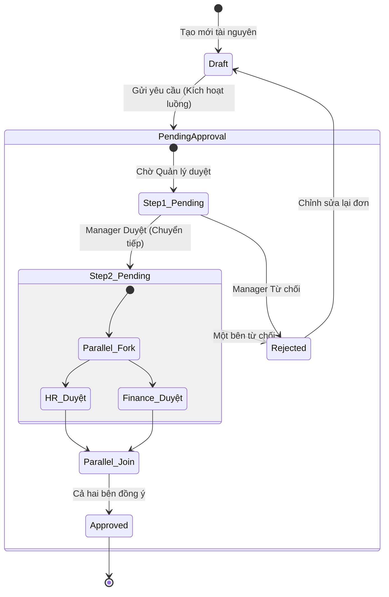

# Chương 8: Nền tảng Quy trình Công việc (Workflow Platform)

## 1. Thiết kế Động cơ Quy trình (Generic Workflow Engine)

Workflow Engine của Atlas được thiết kế dưới dạng một **Động cơ Máy trạng thái (State Machine Engine)** hướng tài nguyên. Động cơ này không sở hữu dữ liệu nghiệp vụ mà chỉ quản lý vòng đời trạng thái của bất kỳ thực thể nào đăng ký liên kết (Ví dụ: `hrm.leave_request`, `crm.deal`, `procurement.purchase_order`).



---

## 2. Đặc tả Cấu trúc Máy trạng thái & Điều kiện (State Machine & Conditions Schema)

Mỗi quy trình được định nghĩa bằng một **Sơ đồ Quy trình (Workflow Schema)** lưu cấu trúc JSON. Bộ biên dịch (Compiler) của engine sẽ đọc schema này để kiểm soát luồng di chuyển trạng thái.

```json
{
  "workflowCode": "hrm_leave_flow",
  "resourceType": "hrm.leave_request",
  "initialState": "DRAFT",
  "states": {
    "DRAFT": {
      "type": "INITIAL",
      "allowedTransitions": ["SUBMIT"]
    },
    "PENDING_APPROVAL": {
      "type": "TASK",
      "assigneeStrategy": "ORG_MANAGER",
      "timeout": "48h",
      "reminderInterval": "12h",
      "allowedTransitions": ["APPROVE", "REJECT"]
    },
    "APPROVED": {
      "type": "FINAL"
    },
    "REJECTED": {
      "type": "FINAL",
      "allowedTransitions": ["RESUBMIT"]
    }
  },
  "transitions": {
    "SUBMIT": {
      "from": "DRAFT",
      "to": "PENDING_APPROVAL",
      "conditions": {
        "and": [
          {
            "attribute": "resource.duration_days",
            "operator": "LESS_THAN_OR_EQUAL",
            "value": "subject.leave_balance"
          }
        ]
      }
    },
    "APPROVE": {
      "from": "PENDING_APPROVAL",
      "to": "APPROVED"
    }
  }
}
```

*   **`assigneeStrategy`:** Phương thức xác định người phê duyệt một cách động. Thay vì gán cứng User ID, hệ thống phân giải theo cấu trúc Org Model (ví dụ: `ORG_MANAGER` - Trưởng phòng trực tiếp, `DEPARTMENT_HEAD` - Trưởng bộ phận).
*   **`conditions`:** Các ràng buộc nghiệp vụ phải thỏa mãn để bước chuyển trạng thái (Transition) được phép thực thi.

---

## 3. Quy trình Duyệt Song song & Nhánh rẽ (Parallel & Split Flows)

Để xử lý các quy trình phê duyệt phức tạp yêu cầu sự tham gia đồng thời của nhiều phòng ban:

*   **Fork Node (Nhánh rẽ phân tách):** Chia luồng công việc thành nhiều nhiệm vụ phê duyệt song song, độc lập nhau (ví dụ: Một đơn mua hàng trị giá lớn cần được duyệt đồng thời bởi Trưởng phòng Tài chính và Trưởng phòng Thu mua).
*   **Join Node (Hội tụ quy trình):** Điểm đồng bộ hóa các nhánh song song. Hỗ trợ 2 chế độ hội tụ:
    *   `ALL (AND Join)`: Yêu cầu **tất cả** các nhánh song song đều phải trả về kết quả APPROVED để chuyển sang trạng thái tiếp theo.
    *   `ANY (OR Join)`: Chỉ cần **một trong số** các nhánh song song trả về APPROVED là luồng tiếp tục chạy (ví dụ: Bất kỳ một trong ba thành viên hội đồng duyệt đồng ý).

---

## 4. Xử lý Timeout, Nhắc nhở & Leo thang (Escalation)

Việc quản lý thời gian duyệt đơn được vận hành bất đồng bộ thông qua hệ thống hàng đợi công việc nền **BullMQ và Redis**:

```
[Chuyển sang trạng thái PENDING]
               |
               +---> (1) Tạo Approval Task gửi cho Manager
               |
               +---> (2) Đẩy Job hẹn giờ vào BullMQ (Delayed Job)
                           - Job 1: Reminder sau 12 giờ
                           - Job 2: Timeout sau 48 giờ
```

1.  **Cơ chế Nhắc nhở (Reminder):**
    *   Khi nhiệm vụ chuyển sang trạng thái chờ, một delayed job được lập lịch trên BullMQ với thời gian trễ là 12 tiếng.
    *   Khi job kích hoạt sau 12 tiếng, Worker kiểm tra trạng thái nhiệm vụ. Nếu nhiệm vụ vẫn là `PENDING_APPROVAL`, hệ thống gửi email/thông báo nhắc nhở đến Manager, sau đó lập lịch tiếp một job nhắc nhở tiếp theo.
    *   Nếu nhiệm vụ đã hoàn thành trước đó, job nhắc nhở tự động bị hủy bỏ.
2.  **Cơ chế Quá hạn & Leo thang (Timeout & Escalation):**
    *   Một delayed job thứ hai được lập lịch với thời gian trễ bằng thời gian timeout cấu hình (ví dụ: 48 tiếng).
    *   Khi kích hoạt sau 48 tiếng, nếu nhiệm vụ vẫn chưa được xử lý:
        *   Hệ thống đọc cấu hình `EscalationStrategy` của bước đó.
        *   Tự động cập nhật nhiệm vụ cũ thành `EXPIRED` hoặc `AUTO_REJECTED`.
        *   Tạo một nhiệm vụ phê duyệt mới và định tuyến trực tiếp lên cấp trên trực tiếp của người duyệt cũ (Escalated Assignee).
3.  **Cơ chế Uỷ quyền (Delegation):**
    *   Tại thời điểm tạo nhiệm vụ phê duyệt, hệ thống kiểm tra bảng `DelegationRule` của Tenant.
    *   Nếu phát hiện người duyệt gốc (A) đang thiết lập ủy quyền cho người duyệt tạm thời (B) trong khoảng thời gian hiện tại, hệ thống tự động gán nhiệm vụ phê duyệt cho B, đồng thời ghi chú rõ: *"Được ủy quyền từ A"*.
