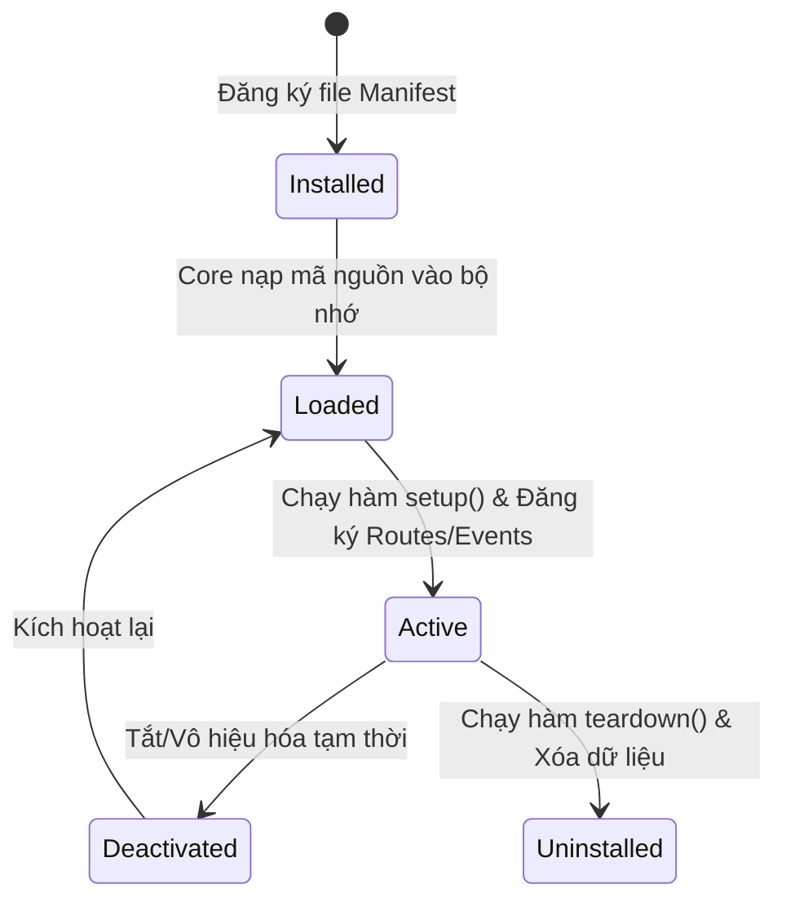

# Chương 9: Nền tảng Dữ liệu Đặc tả (Metadata Platform)

## 1. Thiết kế Giao diện Động & Dữ liệu Đặc tả (Dynamic Layout & UI Schemas)

Một trong những thách thức lớn nhất của các ứng dụng doanh nghiệp là nhu cầu thay đổi giao diện liên tục (thêm ô nhập liệu, thay đổi cột hiển thị, đổi cấu trúc thanh điều hướng). Thay vì lập trình cứng (hardcoding) ở Frontend, Atlas thiết kế giao diện theo mô hình **Metadata-Driven UI (Giao diện hướng Dữ liệu đặc tả)**.

```
[Next.js App] 
      |
      +---> (1) Gửi yêu cầu: GET /api/v1/metadata/ui/hrm.employee
      |
[API Server]
      |
      +---> (2) Truy xuất Metadata JSON từ Redis Cache / PostgreSQL
      |           (Cấu hình: Bố cục cột, Thứ tự ô nhập, Validators)
      |
[Next.js App]
      |
      +---> (3) Render Engine tự động dựng UI thành các React Component tương ứng
```

*   **UI Schema:** Một tài liệu JSON quy định cách sắp xếp giao diện. Khi người dùng mở một form, Next.js sẽ gọi API lấy UI Schema này và tự động dựng giao diện (Dynamic Renderer) mà không cần build lại ứng dụng client.

---

## 2. Lưu trữ Dữ liệu Động trong Cơ sở dữ liệu (PostgreSQL JSONB Pattern)

Để lưu trữ các thuộc tính tùy biến do người dùng tự định nghĩa mà không cần chạy SQL Migration, hệ thống sử dụng kết hợp giữa **Structured Schema** và **JSONB Schema** trong PostgreSQL:

*   **Bảng chứa Metadata (`attribute_metadata`):** Lưu trữ định nghĩa của trường dữ liệu động.
    ```sql
    CREATE TABLE attribute_metadata (
        id UUID PRIMARY KEY,
        tenant_id UUID NOT NULL,
        resource_type VARCHAR(50) NOT NULL, -- e.g., 'hrm.employee'
        attribute_key VARCHAR(50) NOT NULL, -- e.g., 'passport_number'
        display_name VARCHAR(100) NOT NULL,
        data_type VARCHAR(20) NOT NULL, -- TEXT, NUMBER, DATE, JSON
        validation_rules JSONB, -- Regex, Min, Max, Required
        security_level VARCHAR(20) NOT NULL -- PUBLIC, INTERNAL, CONFIDENTIAL
    );
    ```
*   **Cột JSONB trên bảng thực thể vật lý:** Bảng lưu trữ chính (ví dụ: `employee`) sẽ có cấu trúc gồm các cột cố định (hệ thống) và một cột `attributes` kiểu dữ liệu `JSONB` để chứa các trường mở rộng.
*   **Ví dụ dữ liệu lưu trữ:**
    *   *Cấu hình Metadata:* Đăng ký trường `blood_type` kiểu chuỗi ký tự.
    *   *Dữ liệu thực tế:* `attributes` = `{"blood_type": "O", "passport_number": "B1234567"}`.
*   **Tối ưu hóa tìm kiếm:** Tạo chỉ mục nâng cao **GIN (Generalized Inverted Index)** trên cột `attributes` để tăng tốc độ truy vấn tìm kiếm dữ liệu nằm sâu trong JSONB:
    `CREATE INDEX idx_employee_attributes ON employee USING gin (attributes);`

---

## 3. Bộ Kiểm tra Dữ liệu Động (Dynamic Validation Engine)

Khi người dùng nhập liệu trên Form động, dữ liệu gửi về Backend phải được kiểm tra tính hợp lệ trước khi lưu. Atlas xây dựng một **Dynamic Validation Engine** hoạt động như sau:

1.  Hệ thống tải danh sách `validation_rules` từ bảng `attribute_metadata` của Tenant tương ứng.
2.  Quy tắc kiểm định hỗ trợ các điều kiện:
    *   `required`: Kiểm tra không được để trống.
    *   `min`, `max`: Cho số hoặc ngày tháng.
    *   `pattern`: Đối chiếu biểu thức chính quy (Regular Expression - Regex).
    *   `reference`: Đối chiếu sự tồn tại của khóa ngoại ở một bảng khác (ví dụ: Giá trị nhập vào phải tồn tại trong bảng `OrgNode`).
3.  Bộ kiểm dịch ở Backend sẽ lặp qua các thuộc tính gửi lên và biên dịch chúng qua một validator chạy động. Nếu phát hiện vi phạm, hệ thống từ chối lưu và trả về danh sách mã lỗi định dạng chi tiết.

---

## 4. Kiến trúc Hệ thống Plugin & SDK

Hệ thống cho phép các đối tác bên thứ ba phát triển các module mở rộng (ví dụ: Module Tuyển dụng trực tuyến, Module Đánh giá năng lực 360 độ) và cắm vào Atlas Platform thông qua một **Plugin SDK** tiêu chuẩn.

### 4.1. Vòng đời Plugin (Plugin Lifecycle)
Mỗi plugin phải thực hiện đúng giao diện vòng đời do Platform quản lý:



### 4.2. Giao diện Plugin SDK (Plugin SDK Specification)
Mỗi Plugin bắt buộc phải khai báo một file Manifest cấu hình (`plugin.manifest.json`) và triển khai một lớp kế thừa từ `AtlasPlugin` base class:

```typescript
// Giao diện trừu tượng định nghĩa trong Core Platform SDK (Không chứa code thực thi)
export interface IPluginManifest {
  id: string;
  name: string;
  version: string;
  requiredCoreVersion: string;
  permissionsRequired: string[];
}

export abstract class AtlasPlugin {
  readonly manifest: IPluginManifest;
  
  // Khởi tạo tài nguyên, đăng ký database connection
  abstract onInstall(context: PluginContext): Promise<void>;
  
  // Đăng ký API Routes, Event Subscribers với Platform Core
  abstract onEnable(context: PluginContext): Promise<void>;
  
  // Giải phóng bộ nhớ, dọn dẹp hàng đợi tác vụ
  abstract onDisable(context: PluginContext): Promise<void>;
  
  // Dọn dẹp dữ liệu khi gỡ cài đặt hoàn toàn
  abstract onUninstall(context: PluginContext): Promise<void>;
}
```

### 4.3. Cô lập Runtime của Plugin (Runtime Isolation)
Để tránh trường hợp một plugin bị lỗi bộ nhớ (Memory Leak) hoặc chứa mã độc làm ảnh hưởng đến Core Platform:
*   *Giải pháp tối ưu:* Các plugin sẽ được đóng gói dưới dạng các Module độc lập. Trong môi trường Microservices tương lai, mỗi plugin chạy trong một Docker Container / Pod riêng biệt. 
*   *Môi trường Modular Monolith hiện tại:* Sử dụng cơ chế cách ly phân quyền của NestJS và hạn chế quyền truy cập trực tiếp vào biến môi trường hệ thống. Các kết nối cơ sở dữ liệu của Plugin được cấp quyền qua một tài khoản database hạn chế (limited database user) chỉ được xem schema của chính nó.
