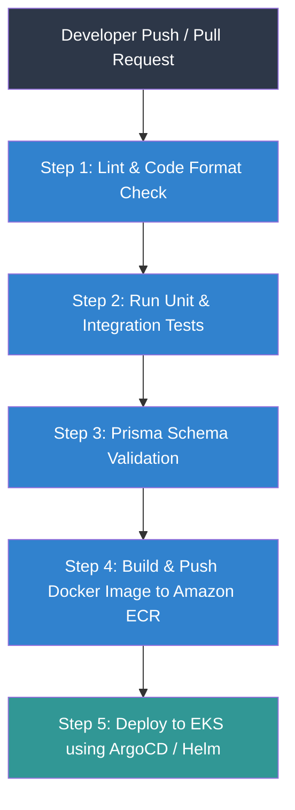
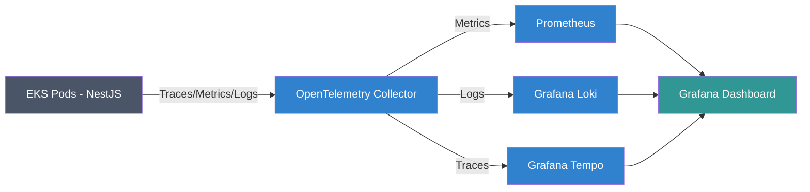

# Chương 12: Cơ sở Hạ tầng & Vận hành (Infrastructure & Operations)

## 1. Đóng gói Container & Docker Multi-stage Builds

Để đảm bảo dung lượng Docker Image nhỏ nhất (giảm bề mặt tấn công bảo mật và tăng tốc độ kéo Image khi tự động scale-out), Atlas áp dụng quy trình **Multi-stage Build** cho NestJS Backend:

```dockerfile
# Stage 1: Build & Compile TypeScript
FROM node:20-alpine AS builder
WORKDIR /app
COPY package*.json ./
COPY prisma ./prisma/
RUN npm ci
COPY . .
RUN npx prisma generate
RUN npm run build
RUN npm prune --production # Dọn dẹp devDependencies

# Stage 2: Runtime Container (Dung lượng siêu nhẹ)
FROM node:20-alpine AS runner
WORKDIR /app
ENV NODE_ENV=production
COPY --from=builder /app/package*.json ./
COPY --from=builder /app/node_modules ./node_modules
COPY --from=builder /app/dist ./dist
COPY --from=builder /app/prisma ./prisma

# Tạo user không có đặc quyền root để chạy container bảo mật
RUN addgroup -g 1001 -S nodejs && adduser -S nestjs -u 1001
USER nestjs

EXPOSE 3000
CMD ["node", "dist/main.js"]
```

---

## 2. Quy trình Tích hợp & Triển khai liên tục (CI/CD Pipeline)

Quy trình CI/CD được tự động hóa hoàn toàn thông qua **GitHub Actions**:



*   **ArgoCD (GitOps):** Việc triển khai lên Kubernetes sử dụng mô hình GitOps. Cluster tự động đồng bộ trạng thái thực tế với cấu hình khai báo trong kho lưu trữ Git (Infrastructure and Manifests repository).

---

## 3. Kiến trúc Hạ tầng Khai báo (Terraform Directory Structure)

Để quản lý hạ tầng AWS một cách nhất quán và dễ nhân bản, chúng tôi tổ chức thư mục mã nguồn **Terraform** theo mô-đun:

```
terraform-infra/
├── environments/
│   ├── dev/
│   │   ├── main.tf
│   │   └── variables.tf
│   └── prod/
│       ├── main.tf
│       ├── backend.tf            # Lưu trữ State file trên S3 + DynamoDB Lock
│       └── variables.tf
└── modules/
    ├── vpc/                     # Thiết lập VPC, Subnets (Public/Private), NAT Gateway
    ├── eks/                     # Khởi tạo EKS Cluster, Node Groups, IAM Roles
    ├── rds/                     # Amazon RDS PostgreSQL (Master, Read Replicas)
    ├── elasticache/             # Amazon ElastiCache Redis Cluster
    └── s3/                      # Các buckets S3 lưu trữ tài liệu (cấu hình Object Lock)
```

---

## 4. Khung Giám sát & Quan sát (Observability Framework)

Hệ thống triển khai mô hình quan sát toàn diện dựa trên ba cột trụ: **Logs (Nhật ký), Metrics (Chỉ số), và Traces (Dấu vết thực thi)**.



1.  **Centralized Logging (Loki / ELK Stack):**
    *   Ứng dụng sử dụng thư viện logging Pino ghi log định dạng **JSON** trực tiếp ra stdout.
    *   **Promtail/FluentBit** chạy dưới dạng DaemonSet trên Kubernetes để thu gom log và đẩy về hệ thống lưu trữ tập trung **Grafana Loki** để truy vấn tìm kiếm nhanh.
2.  **Infrastructure & Application Metrics (Prometheus & Grafana):**
    *   Thu thập các chỉ số tài nguyên (CPU, Memory, Disk) và chỉ số ứng dụng (Request Rate, Error Rate, HTTP Latency, DB Connection Pool status).
    *   **Grafana** làm công cụ trực quan hóa biểu đồ trực quan thời gian thực.
3.  **Distributed Tracing (OpenTelemetry & Tempo/Jaeger):**
    *   Sử dụng SDK **OpenTelemetry** tự động tiêm mã (Auto-instrumentation) vào NestJS và Prisma.
    *   Mỗi API request được gán một `trace_id` duy nhất xuyên suốt từ API Gateway, đi qua các NestJS modules, đến tận các câu truy vấn cơ sở dữ liệu PostgreSQL. Giúp kỹ sư xác định chính xác điểm nghẽn hiệu năng nằm ở dòng code hay câu truy vấn nào.

---

## 5. Chiến lược Khôi phục sau Thảm họa (Disaster Recovery - DR)

Để đáp ứng SLO phục hồi dữ liệu tối đa (**RTO < 15 phút, RPO < 5 phút**):

*   **RDS Continuous Backup (PITR):**
    *   Kích hoạt tính năng sao lưu liên tục của Amazon RDS PostgreSQL, cho phép khôi phục dữ liệu về bất kỳ thời điểm nào trong quá khứ (Point-in-Time Recovery) chính xác đến từng giây.
*   **Active-Passive Cross-Region Replication:**
    *   Dữ liệu từ RDS Primary Region được nhân bản bất đồng bộ liên tục sang RDS Read Replica ở một AWS Region khác (Passive Region).
    *   Tất cả tài liệu tĩnh lưu trên Amazon S3 được tự động nhân bản chéo vùng (Cross-Region Replication).
*   **Kế hoạch Failover tự động:**
    *   Khi Region chính bị sập hoàn toàn:
        1.  Hệ thống DNS (Amazon Route 53) phát hiện sự cố qua Health Check và tự động chuyển hướng (failover) traffic sang Region phụ.
        2.  Thực hiện nâng cấp RDS Read Replica ở Region phụ lên thành Master.
        3.  Kích hoạt khởi chạy các Pods ứng dụng trên cụm EKS dự phòng tại Region phụ.
