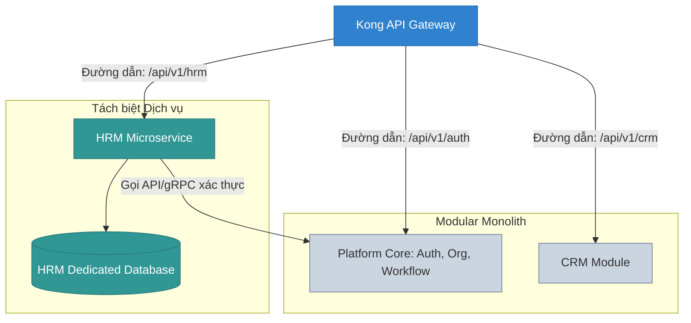

# Chương 13: Chiến lược Co giãn Hệ thống (Scalability Strategy)

## 1. Cơ chế Bộ nhớ đệm Đa tầng (Multi-level Caching Architecture)

Để giảm tải tối đa cho cơ sở dữ liệu quan hệ PostgreSQL và đạt mục tiêu response time < 80ms, hệ thống triển khai cơ chế **Cache-Aside Pattern** đa tầng:

```
[API Request]
      |
      v
[L1 Cache (In-Memory Node.js)] -------> (Có dữ liệu?) ---> Trả ngay kết quả (Hạn: 5-10 giây)
      | Không
      v
[L2 Cache (Redis Cluster)] -----------> (Có dữ liệu?) ---> Lưu L1 & Trả kết quả (Hạn: 30 phút)
      | Không
      v
[PostgreSQL Database (Primary/Replica)] -> Lưu L2, L1 & Trả kết quả
```

*   **L1 Cache (In-Memory Cache):** Nằm trong bộ nhớ RAM của chính tiến trình Node.js (sử dụng thư viện `lru-cache`). Chỉ dùng cho các cấu hình siêu tĩnh, ít khi thay đổi (như các thiết lập hệ thống chung, danh mục loại nút tổ chức). Thời gian hết hạn (TTL) rất ngắn (5–10 giây).
*   **L2 Cache (Distributed Cache - Redis):** Cụm Redis Cluster dùng chung cho tất cả các Web Server Nodes. Lưu trữ các dữ liệu cấu hình đặc tả (UI Metadata, Org Chart structure, Quyền truy cập phân giải của từng User).
*   **Chống hiện tượng Thác đổ Cache (Cache Stampede Mitigation):**
    Khi một key cache cực kỳ nóng (hot key) hết hạn, hàng ngàn request cùng lúc truy cập sẽ không tìm thấy cache và đồng loạt truy vấn xuống DB làm sập database.
    *   *Giải pháp:* Áp dụng cơ chế khóa phân tán (**Mutex Lock** sử dụng Redlock trên Redis). Chỉ một tiến trình đầu tiên lấy được lock để truy vấn DB và ghi lại vào Cache; các tiến trình khác chờ trong vài mili giây và đọc lại từ Cache.

---

## 2. Quản lý Kết nối Cơ sở dữ liệu (Database Connection Pooling)

Thiết kế NestJS Stateless Server co giãn liên tục có thể tạo ra hàng ngàn kết nối song song làm quá tải giới hạn kết nối của PostgreSQL.
*   **Giải pháp:** Tích hợp **pgBouncer** hoặc **AWS RDS Proxy** đứng trước PostgreSQL.
*   **Cơ chế hoạt động:** pgBouncer hoạt động ở chế độ **Transaction Pooling**. Kết nối vật lý đến PostgreSQL chỉ được giữ trong thời gian ngắn ngủi khi thực thi một transaction SQL thực tế, sau đó lập tức trả lại pool cho các request khác sử dụng. Giúp một máy chủ PostgreSQL RAM 16GB có thể đáp ứng hàng chục ngàn kết nối đồng thời từ ứng dụng.

---

## 3. Co giãn Ngang và Thiết kế Stateless (Stateless Horizontal Scaling)

Tất cả các API Pods chạy NestJS được thiết kế tuân thủ nguyên lý **12-Factor App (Stateless)**:
*   **Không lưu trạng thái trong bộ nhớ cục bộ:** Phiên làm việc (Session), file tải lên, trạng thái công việc nền tuyệt đối không lưu cục bộ trên ổ đĩa của Pod.
    *   *Session:* Lưu tập trung trên Redis.
    *   *Files/Documents:* Tải trực tiếp lên Amazon S3.
*   **Quy tắc co giãn:** Sử dụng **Kubernetes HPA (Horizontal Pod Autoscaler)** cấu hình dựa trên 2 chỉ số: CPU Utilization (>70%) và HTTP Request Queue Depth. Hệ thống tự động khởi chạy thêm các bản sao Pods mới trong vòng dưới 3 phút khi phát hiện quá tải.

---

## 4. Chiến lược Tách nhỏ sang Microservices (Strangler Fig Pattern)

Hệ thống được thiết kế dạng Modular Monolith ngay từ đầu để dễ phát triển, nhưng khi quy mô tổ chức tăng lên (ví dụ: Module HRM có lượng nhân sự chấm công tăng vọt làm ảnh hưởng đến hiệu năng phân hệ Auth), chúng tôi sẽ tách nhỏ HRM thành một Microservice độc lập bằng mô hình **Strangler Fig Pattern (Cây sung bóp cổ)**:



### Các bước thực hiện tách dịch vụ không làm gián đoạn hệ thống:

1.  **Bước 1: Tách biệt Cơ sở dữ liệu Logic (Database Schema Separation):**
    Di chuyển toàn bộ các bảng của HRM sang một database schema riêng trong PostgreSQL. Cấm hoàn toàn việc truy vấn chéo schema bằng các lệnh SQL JOIN trực tiếp từ code.
2.  **Bước 2: Thay đổi Giao tiếp nội bộ (Refactor to Interfaces):**
    Chuyển đổi các lời gọi hàm trực tiếp sang giao tiếp bất đồng bộ qua Event Hub hoặc các cuộc gọi thông qua Client Proxy Interface (để sau này dễ thay bằng HTTP/gRPC).
3.  **Bước 3: Tách mã nguồn và Triển khai riêng (Extract Code & Deploy):**
    Tách mã nguồn của HRM sang một Repo/Project độc lập. Triển khai nó trên một cụm Pods riêng biệt trong Kubernetes, sở hữu Database vật lý độc lập.
4.  **Bước 4: Định tuyến lại API Gateway (Reroute Traffic):**
    Cấu hình lại API Gateway (Kong) để chuyển hướng tất cả các request có tiền tố `/api/v1/hrm/*` sang Microservice HRM mới. Tiến trình Monolith cũ không còn nhận traffic của HRM nữa.
