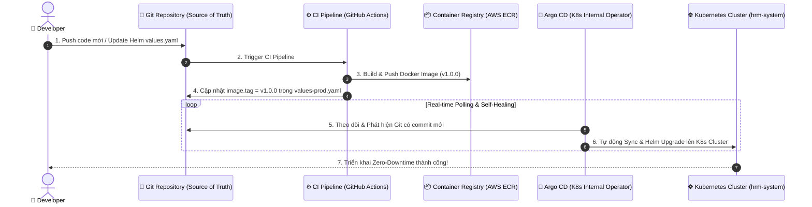

# ⛵ STAGE 4 MASTERCLASS: HELM CHART & GITOPS WORKFLOW (ARGO CD)
### *Dự Án: Atlas Enterprise Platform (HRM System)*

Tài liệu hướng dẫn thực chiến chuyên sâu về **Đóng gói Helm Chart đa môi trường** và **Thiết lập luồng GitOps Tự động hóa triển khai bằng Argo CD**.

---

## 📋 MỤC LỤC

1. [Tư Duy Cốt Lõi: Tại Sao Cần Helm & GitOps?](#1-tư-duy-cốt-lõi-tại-sao-cần-helm--gitops)
2. [Sơ Đồ Luồng GitOps Workflow (Argo CD Pull-Based Architecture)](#2-sơ-đồ-luồng-gitops-workflow)
3. [Thiết Kế Helm Chart Đa Môi Trường (`charts/atlas-hrm`)](#3-thiết-kế-helm-chart-đa-môi-trường)
4. [Cấu Hình GitOps Argo CD Application (`gitops/argo-app.yaml`)](#4-cấu-hình-gitops-argo-cd-application)
5. [So Sánh Push-Based CI/CD Cổ Điển vs. Pull-Based GitOps](#5-so-sánh-push-based-cicd-vs-pull-based-gitops)
6. [Quy Trình Vận Hành 1-Click (Ops Runbook)](#6-quy-trình-vận-hành-1-click)

---

## 1. TƯ DUY CỐT LÕI: TẠI SAO CẦN HELM & GITOPS?

### 🔹 Vấn Đề Với RAW K8S MANIFESTS (Nhu Cầu Cần Helm)
Khi hệ thống HRM của bạn cần triển khai lên 3 môi trường (**Dev**, **Staging**, **Production**):
* **Cách làm thủ công (Raw YAML):** Bạn phải duy trì 3 bộ file YAML hoàn toàn riêng biệt. Khi thay đổi một dòng cấu hình (như cập nhật IP Database), bạn phải sửa tay ở cả 3 thư mục ➔ **Rất tốn thời gian và dễ xảy ra sai sót.**
* **Giải pháp HELM CHART (Package Manager cho K8s):**
  * Helm giống như `npm` hoặc `apt` nhưng dành riêng cho Kubernetes.
  * Helm biến toàn bộ file YAML thành **Templates** và tập trung toàn bộ biến cấu hình vào file `values.yaml`.
  * Khi cần deploy sang Dev: Dùng `values-dev.yaml`. Khi cần deploy sang Prod: Dùng `values-prod.yaml`. Tất cả mã nguồn YAML chỉ cần duy trì 1 bộ duy nhất!

---

### 🔹 Vấn Đề Với PUSH-BASED CI/CD (Nhu Cầu Cần GitOps & Argo CD)

```text
 ❌ PUSH-BASED (CỔ ĐIỂN - RỦI RO BẢO MẬT):
 [Developer Push Code] ➔ [CI Server (GitHub Actions)] ──(kubectl apply)──► [K8s Cluster API]
 (CI Server phải giữ K8s Admin Credentials & Mở K8s API Port ra ngoài Internet!)

 🟢 PULL-BASED GITOPS (CHUẨN ENTERPRISE):
 [Developer Push Code] ➔ [Git Repository] ◄──(Pull & Sync)── [Argo CD Bot Trong K8s]
 (Argo CD nằm hoàn toàn BÊN TRONG K8s Cluster, tự kéo thay đổi từ Git về, không mở port!)
```

* **GitOps là gì?** Là triết lý coi **Git Repository là Nguồn Chân Lý Duy Nhất (Single Source of Truth)** cho toàn bộ hạ tầng và ứng dụng.
* **Argo CD là gì?** Là một con Bot thông minh nằm trực tiếp bên trong Kubernetes Cluster. Nó liên tục giám sát Git Repo. Mỗi khi bạn `git push` một thay đổi (như đổi image tag hoặc RAM limit), Argo CD tự động kéo (pull) thay đổi về và đồng bộ (Sync) lên Cluster!

---

## 2. SƠ ĐỒ LUỒNG GITOPS WORKFLOW (PULL-BASED ARCHITECTURE)



---

## 3. THIẾT KẾ HELM CHART ĐA MÔI TRƯỜNG (`charts/atlas-hrm`)

### 📂 Cấu Trúc Thư Mục Helm Chart Chuẩn Enterprise

```text
charts/atlas-hrm/
├── Chart.yaml                            # Định nghĩa Metadata (Version: 1.0.0)
├── values.yaml                           # Cấu hình mặc định cho tất cả môi trường
├── values-dev.yaml                       # Cấu hình riêng cho môi trường DEV
├── values-prod.yaml                      # Cấu hình riêng cho môi trường PRODUCTION
└── templates/                            # Bộ YAML Templates tự động điền biến
    ├── configmap-secret.yaml
    ├── backend-deployment.yaml
    ├── frontend-deployment.yaml
    ├── ingress.yaml
    └── hpa.yaml
```

### 📄 File `values-dev.yaml` (Môi trường Dev - Tinh gọn chi phí)
```yaml
global:
  environment: development
  namespace: hrm-dev

backend:
  replicaCount: 1                         # Dev chỉ cần 1 Pod
  image:
    tag: dev-latest
  resources:
    requests: { cpu: 100m, memory: 128Mi }

hpa:
  backend: { enabled: false }             # Tắt Auto-scaling trên Dev để tiết kiệm
```

### 📄 File `values-prod.yaml` (Môi trường Prod - High Availability)
```yaml
global:
  environment: production
  namespace: hrm-system

backend:
  replicaCount: 3                         # Prod chạy 3 Replicas chống sập
  image:
    tag: v1.0.0
  resources:
    requests: { cpu: 500m, memory: 512Mi }

hpa:
  backend:
    enabled: true
    minReplicas: 3
    maxReplicas: 15                       # Tự mở rộng tối đa 15 Pods khi cháy tải
```

---

## 4. CẤU HÌNH GITOPS ARGO CD APPLICATION (`gitops/argo-app.yaml`)

Mã nguồn khai báo Argo CD Application tự động hóa 100%:

```yaml
apiVersion: argoproj.io/v1alpha1
kind: Application
metadata:
  name: atlas-hrm-production
  namespace: argocd
spec:
  project: default

  # Nguồn Chân Lý Duy Nhất (Git Repository)
  source:
    repoURL: 'https://github.com/TuanStark/Atlas-Enterprise-Platform.git'
    targetRevision: main
    path: charts/atlas-hrm
    helm:
      valueFiles:
        - values-prod.yaml                # Sử dụng file giá trị Production

  # Đích đến triển khai trên Cluster
  destination:
    server: 'https://kubernetes.default.svc'
    namespace: hrm-system

  # Chính Sách Đồng Bộ Tự Động (Automated Sync Policy)
  syncPolicy:
    automated:
      prune: true                         # Tự xóa Pod/Svc trên K8s nếu đã bị xóa khỏi Git
      selfHeal: true                      # Tự Revert nếu ai đó cố tình gõ tay sửa bậy trên K8s
    syncOptions:
      - CreateNamespace=true
```

---

## 5. SO SÁNH PUSH-BASED CI/CD VS. PULL-BASED GITOPS

| Tiêu chí | Push-Based CI/CD (Cổ điển) | Pull-Based GitOps (Argo CD) |
| :--- | :--- | :--- |
| **Cơ chế triển khai** | CI Server đẩy (`kubectl apply`) vào K8s. | Argo CD tự kéo (`git pull`) từ Git về K8s. |
| **Bảo mật K8s API** | 🔴 Phải mở port K8s API ra ngoài Internet. | 🟢 **Bảo mật tuyệt đối**: Argo CD nằm trong K8s. |
| **K8s Credentials** | 🔴 Lưu Credentials trên CI Server (Rủi ro lộ). | 🟢 **Không lưu Credentials ở đâu ngoài Cluster**. |
| **Chống sửa tay (Drift)** | 🔴 Không biết nếu có ai đó sửa tay trên K8s. | 🟢 **Self-Healing**: Tự Revert về đúng Code Git. |
| **Lịch sử & Rollback** | Phức tạp, phụ thuộc vào log CI/CD. | 🟢 **Chỉ cần `git revert` 1 commit là K8s tự rollback!** |

---

## 6. QUY TRÌNH VẬN HÀNH 1-CLICK (OPS RUNBOOK)

### 🚀 Cách 1: Thao Tác Thủ Công Bằng Helm CLI (Local / Testing)

```bash
# 1. Lint kiểm tra lỗi cú pháp Helm Chart
helm lint charts/atlas-hrm

# 2. Xem trước kết quả render YAML của môi trường Production
helm template atlas-hrm charts/atlas-hrm -f charts/atlas-hrm/values-prod.yaml

# 3. Triển khai lên K8s Cluster bằng Helm
helm upgrade --install atlas-hrm charts/atlas-hrm \
  --namespace hrm-system \
  --create-namespace \
  -f charts/atlas-hrm/values-prod.yaml
```

### 🚀 Cách 2: Kích Hoạt GitOps Argo CD (Production Workflow)

```bash
# 1. Cài đặt Argo CD vào Cluster (nếu chưa có)
kubectl create namespace argocd
kubectl apply -n argocd -f https://raw.githubusercontent.com/argoproj/argo-cd/stable/manifests/install.yaml

# 2. Khai báo Argo CD Application (Chỉ cần chạy 1 lần duy nhất!)
kubectl apply -f gitops/argo-app.yaml
```

Từ thời điểm này trở đi, bạn **KHÔNG CẦN gõ bất kỳ lệnh `kubectl` hay `helm` nào nữa**!  
Mỗi lần muốn deploy bản mới, bạn chỉ cần chỉnh sửa `values-prod.yaml` trên Git và `git push`. Argo CD sẽ tự động làm tất cả phần việc còn lại! 🚀
