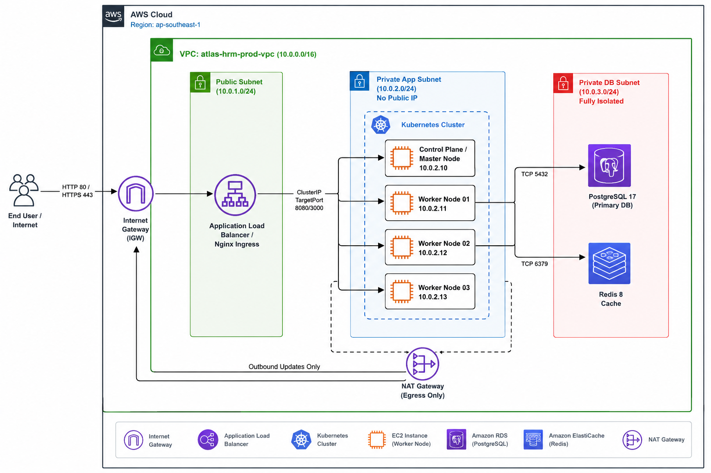

# ☸️ Kubernetes Enterprise Manifests - Atlas HRM Platform

> **Bộ Manifests Kubernetes Production-Ready dành cho Atlas Enterprise Platform**



---

## 📋 MỤC LỤC MANIFESTS

| STT | Manifest File | Mô tả chức năng |
| :---: | :--- | :--- |
| 1 | `00-namespace.yaml` | Tạo Namespace cách ly `hrm-system` |
| 2 | `01-configmap.yaml` | Cấu hình biến môi trường tĩnh (Host, Port, DB Name) |
| 3 | `01-secret.yaml` | Lưu trữ bí mật mã hóa (Postgres Password, JWT Secret) |
| 4 | `02-storage.yaml` | Đăng ký PVCs cho PostgreSQL (10GB), Redis (2GB) & Uploads (5GB) |
| 5 | `03-postgres-redis.yaml` | Deploy PostgreSQL 17 & Redis 8 kèm theo ClusterIP Services |
| 6 | `04-db-migration-job.yaml` | K8s Job tự động chạy `npx prisma migrate deploy` |
| 7 | `05-backend-deployment.yaml` | Deploy NestJS Backend (2 Replicas, Non-root 1001, Probes, Service) |
| 8 | `06-frontend-deployment.yaml` | Deploy React Vite Frontend (2 Replicas, Nginx Non-root 8080) |
| 9 | `07-ingress.yaml` | Nginx Ingress Rules routing domain `hrm.local` (`/` & `/api`) |
| 10 | `08-hpa.yaml` | Horizontal Pod Autoscaler tự động scale Pods theo CPU 70% |

---

## 🚀 HƯỚNG DẪN TRIỂN KHAI THỰC THI (RUNBOOK)

### 1. Triển khai theo thứ tự chuẩn:

```bash
# 1. Tạo Namespace, ConfigMap & Secret
kubectl apply -f k8s/00-namespace.yaml
kubectl apply -f k8s/01-configmap.yaml
kubectl apply -f k8s/01-secret.yaml

# 2. Tạo Storage PersistentVolumeClaims
kubectl apply -f k8s/02-storage.yaml

# 3. Deploy Databases (PostgreSQL 17 & Redis 8)
kubectl apply -f k8s/03-postgres-redis.yaml

# 4. Chạy DB Migration Job (Prisma)
kubectl apply -f k8s/04-db-migration-job.yaml

# 5. Deploy Backend NestJS & Frontend React
kubectl apply -f k8s/05-backend-deployment.yaml
kubectl apply -f k8s/06-frontend-deployment.yaml

# 6. Deploy Ingress Controller & HPA
kubectl apply -f k8s/07-ingress.yaml
kubectl apply -f k8s/08-hpa.yaml
```

---

## 🔍 KIỂM TRA TRẠNG THÁI HỆ THỐNG

```bash
# Kiểm tra toàn bộ Pods, Services & PVCs trong Namespace hrm-system
kubectl get all,pvc,ingress -n hrm-system

# Xem log thực thi của Backend
kubectl logs -n hrm-system -l app=backend -f

# Xem trạng thái HPA Auto-scaling
kubectl get hpa -n hrm-system
```
